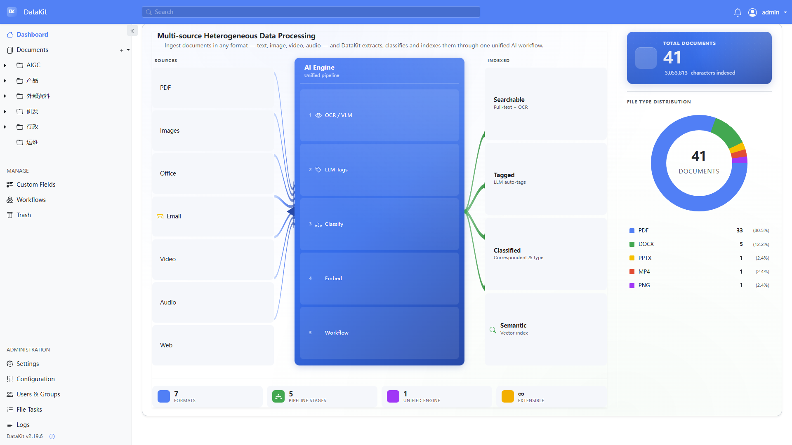

## 📄 AI-Paperless: 智能文档管理系统

**口号：融合 AI 的下一代 Paperless-ngx，让您的文档真正“会说话”和“易管理”。**

本项目基于卓越的开源文档管理系统 **`paperless-ngx`** 深度二次开发，创新性地融合了 **大语言模型（LLM）** 与 **视觉模型（VLM）** 等先进 AI 能力。目标是打造一个功能更强大、交互更智能、管理更高效的**智能文档知识库**，让您的文档真正实现**深度理解与高效利用**。

-----
## ✨ 核心价值与 AI 驱动的增强

原版 `paperless-ngx` 在文档自动化处理和索引方面表现出色。**AI-Paperless** 则聚焦于解决用户在**复杂分类结构**、**信息深度提取**和**多模态内容管理**上的痛点。

### 🚀 基础功能

- 智能组织与索引：标签、通信方、文档类型、存储路径，支持批量编辑与自动建议
- 本地私有与权限控制：数据不出站，细粒度对象权限与公共链接（可设过期）
- OCR 与全文检索：Tesseract 多语言 OCR、结果高亮、自动补全与相似文档推荐
- 多格式支持：PDF、图片、Office 文档、纯文本；PDF/A 长期存档与原件保留
- 现代化交互：自定义仪表盘、拖拽上传、并排编辑、自定义视图与字段
- 邮件与工作流：多邮箱导入与规则、可配置触发与动作的工作流引擎
- 并行处理与健康检查：多核优化、完整性校验、处理队列与状态监控

-----

## 🛠️ 新增特性规划（Roadmap & Status）

我们基于 `paperless-ngx` 核心功能，将深度集成 AI 能力并优化用户体验。

| 特性模块 | 功能描述 | 优先级 | 状态 |
| :--- | :--- | :--- | :--- |
| **组织结构优化** | 实现直观的**树形目录体系**，支持无限级文件夹嵌套。 | 高 | ✅ **已完成** |
| **AI 文档对话** | 集成大语言模型，支持基于文档内容的**智能问答**、关键信息提取和内容解读。 | 中 | ✅ **已完成** |
| **OCR 与内容理解优化** | 使用 **VLM** 识别图片文字，大幅提高**低质量/手机拍摄图片**的文本数字化质量。 | 中 | ✅ **已完成** |
| **AI 提示词管理** | 界面化配置和管理用于 LLM/VLM 的 **系统提示词** 和 **用户提示词模板**。 | 中 | ✅ **已完成** |
| **智能语义检索** | 基于向量嵌入技术实现**语义级搜索**，突破关键词限制。 | 高 | 📋 已规划 |
| **混合检索引擎** | 融合**关键词**、**语义**、**元数据过滤**的多层次搜索策略。 | 高 | 📋 已规划 |
| **多媒体扩展** | 新增对**音频、视频**格式的支持，集成语音识别、内容摘要生成。 | 高 | 📋 已规划 |
| **全局 AI 助手** | 右下角常驻入口，支持**自然语言全局搜索**、**多文档智能摘要**、跨文档问答。 | 高 | 📋 已规划 |
| **可视化仪表盘** | 提供系统概览仪表板，动态展示文档统计、存储分析、处理队列等关键指标。 | 中 | 📋 已规划 |
| **知识库与最佳实践** | 内置完整使用手册、操作指南、场景化最佳实践。 | 中 | 📋 已规划 |

-----

## 快速开始

1. 进入编排目录：
   - `cd ./docker/compose`
2. 启动服务（包含 MariaDB、Redis、Tika、Gotenberg）：
   - `docker compose -f docker-compose.mariadb-tika.yml up -d`
3. 首次访问：
   - 浏览器打开 `http://<主机IP>:8008/`
   - 首次进入需注册管理员账户
   - 
4. 登录后首页与概览：
   - 

提示：编排文件会自动创建 `./consume`（导入）与 `./export`（导出）目录，并挂载至容器，数据卷包括 `data` 与 `media`。如需拉取最新镜像，可在启动前执行 `docker compose -f docker-compose.mariadb-tika.yml pull`。

## 使用前配置

1. 模型配置（LLM/VLM）：
   - 进入设置页，添加一个大语言模型与一个视觉模型
   - 
   - 示例（以火山引擎为例）：
     - 新增 LLM：
     - 新增 VLM：
2. 提示词管理：
   - 系统已内置默认模板，可按业务场景调整
3. OCR 设置：
   - 语言设置：`chi_sim`
   - 启用「VLM 图像理解」，用于提升图片文字识别与内容理解
   - 
4. 保存配置后即可开始使用

## 💡 功能演示

这里将演示几个主要的二次开发功能。

### 1\. 树形目录与自动标签

您可以创建无限级嵌套的目录结构来组织文档，文件上传到特定节点后，**标签会自动继承目录层级**。

  * 创建目录示例：

  * 目录树概览：

  * 上传文件至目录：文件自动被打上基于目录的标签：

### 2\. AI 功能

#### **A. VLM 高质量图片文字识别**

  * **痛点**：传统 OCR 对手机拍摄的低质量/倾斜图片识别效果不佳。

  * **解决方案**：启用 VLM 后，识别效果显著提升。VLM 识别出的内容不仅限于文字，还支持后续的内容理解和分析。

  * 原始图片示例：
    - 
    - 切换至内容视图,可以看到内容识别的很精确：

  * VLM 识别结果（内容标签页）：VLM 准确提取并结构化了图片上的信息。

#### **B. 文档对话 (LLM)**

  * **功能**：在文档详情页，您可以直接与文档内容进行对话问答，实时获取信息。

  * 对话界面入口：

    - 
    - 切换到文档对话：

  * 对话体验：您可以一边浏览文件，一边进行智能问答，实现深度交互。

#### **C. MP4 视频语音转写与摘要**

  * **功能**：上传 MP4（`video/mp4`）后自动提取音频、ASR 转写，并可按配置写入仅转写、仅摘要或二者兼有到文档内容；标题取自文件名，标签与上传关联方式不变。

  * **配置**：需 Docker 镜像中的 **ffmpeg**、默认 **ASR** 模型（如 SiliconFlow `FunAudioLLM/SenseVoiceSmall`），以及摘要模式下的默认 LLM 与 **视频语音摘要提示词**。详见 [docs/configuration.md](docs/configuration.md#video)（`PAPERLESS_VIDEO_CONTENT_MODE`：`transcript` | `summary` | `both`）。

 

## 架构要点

系统架构依赖于多个组件协同工作，以实现文档的上传、处理、索引和存储。

### 🏛️ 技术栈概览

| 组件 | 技术 | 描述 |
| :--- | :--- | :--- |
| **后端** | **Python, Django, Django REST Framework** | 核心业务逻辑、权限控制、工作流引擎、API 接口。 |
| **前端** | **AngularJS** | 现代化的 Web 界面，负责用户交互和数据展示。 |
| **缓存/队列** | **Redis** | 任务队列（Celery）、会话管理和临时数据存储。 |

---

### 核心处理组件

| 组件 | 功能简介 | 输入 | 输出 |
|------|----------|------|------|
| **OCRmyPDF** | 为扫描版 PDF 或图片文件添加可搜索文字层，提升可检索性 | 扫描 PDF、图像文件（JPEG、PNG 等） | 符合 PDF/A-2b 标准的可搜索 PDF |
| **Apache Tika** | 从 1000+ 种文件格式中提取文本与元数据（作者、日期、标题等） | PDF、Office 文档、图像、音频、视频、邮件等 | 结构化文本与元数据 |
| **Gotenberg** | 将 HTML、Markdown、Office 文档等格式转换为 PDF | HTML、Office 文档、图片等 | PDF（也可输出 PNG 截图） |

### 件处理器与解析流程

系统内置多个解析器，根据 MIME 类型自动选择最优处理管道：

| 解析器 | 支持类型 | 处理逻辑 |
|--------|----------|----------|
| `paperless_text` | 纯文本、CSV | 读取文本 → 生成 WEBP 缩略图 |
| `paperless_tika` | Word、Excel、PowerPoint、RTF、ODF 等 | 发送至 Tika 提取文本/元数据 → 使用 Gotenberg 转换为 PDF → 生成缩略图 |
| `paperless_tesseract` | PDF、JPEG、PNG、TIFF、HEIC 等图片格式 | 对图片进行 DPI 估算、去 Alpha 通道，调用 OCRmyPDF 进行 OCR 并生成可搜索 PDF |
| `paperless_mail` | .eml 邮件文件 | 解析邮件头与正文（HTML/文本）→ 使用 Tika 提取内容 → Gotenberg 转 PDF → 生成缩略图 |

### 文件消费流程概览

1. **客户端上传** → POST `/api/documents/post_document/`
2. **格式校验与预处理**  
   - 使用 `libmagic` 检测 MIME 类型  
   - 若为不支持格式则返回 400  
   - 若为可修复 PDF 则按 `application/pdf` 继续处理
3. **写入临时文件**并构造 `ConsumableDocument`
4. **异步任务入队** → 返回 `task_id`
5. **插件流水线执行**：
   - 预检（重复性、ASN、目录校验）
   - 条码处理（若启用则拆分文件或提取 ASN/标签）
   - 工作流触发器应用
   - **主处理阶段**：
     - 按 MIME 选择解析器
     - 执行对应解析流程（见上表）
     - 生成缩略图、解析日期与页数
     - 持久化至数据库并写入归档文件
     - 清理临时文件，推送成功状态

## 许可证与致谢

- 许可证：GNU GPLv3（详见仓库 `LICENSE`）
- 致谢：感谢 `paperless-ngx` 社区与所有贡献者，本项目在其之上进行增强与扩展

