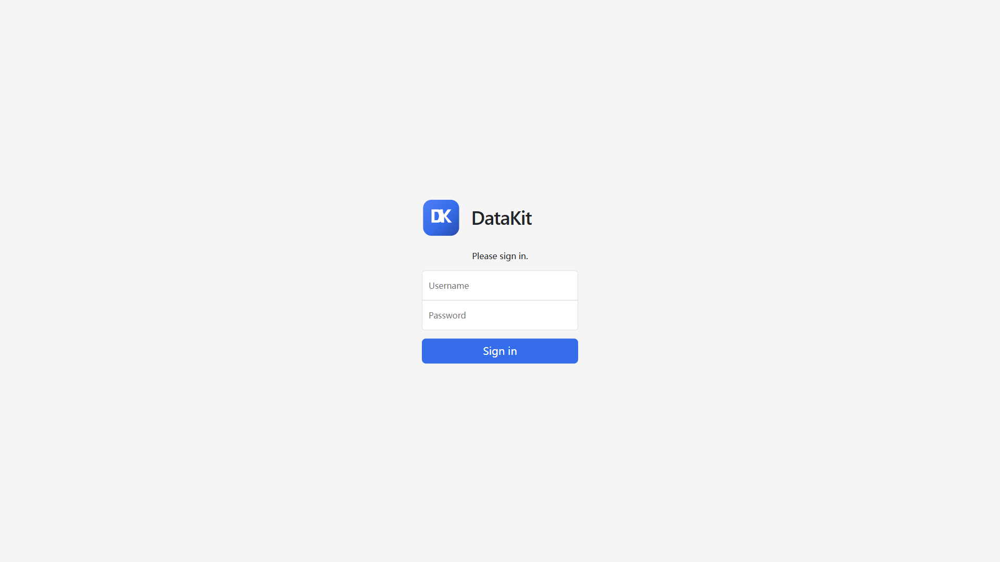
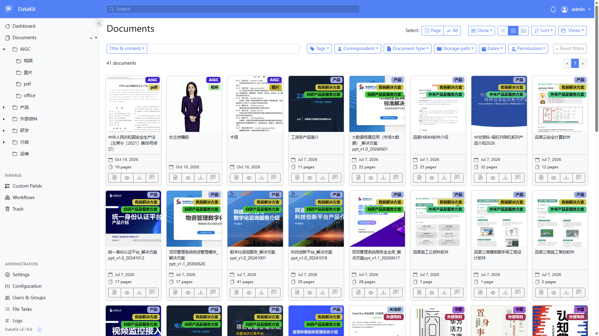
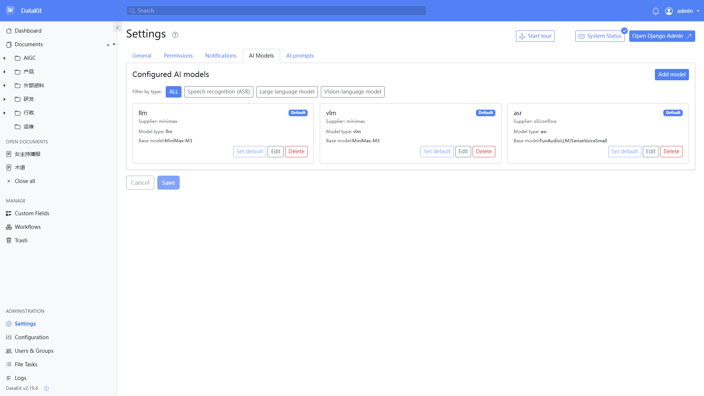
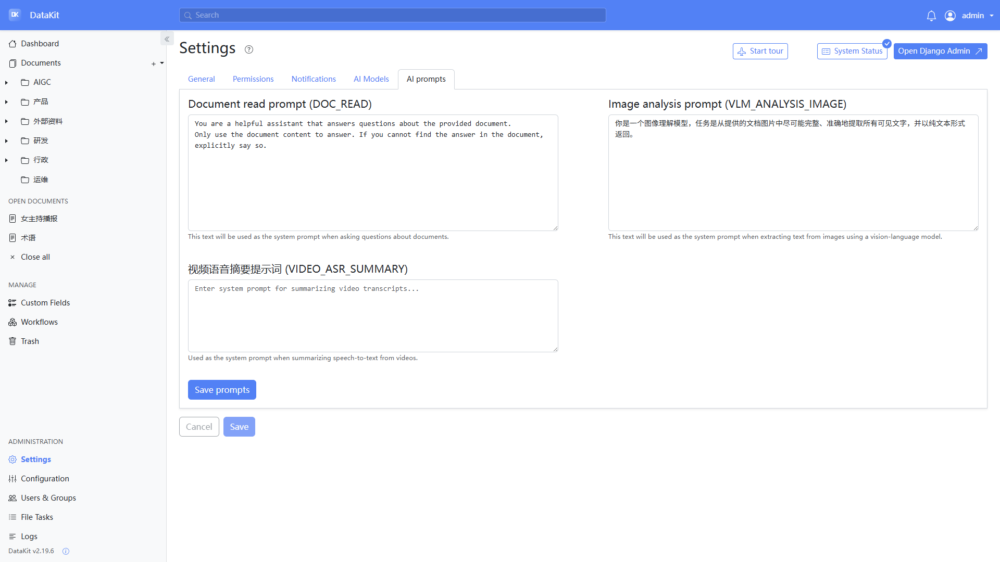
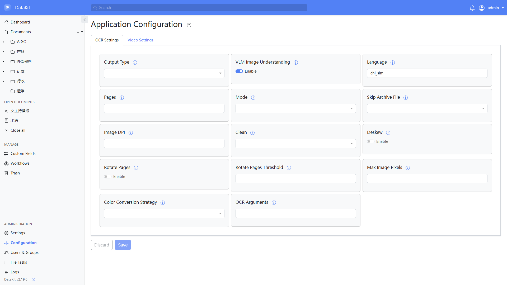
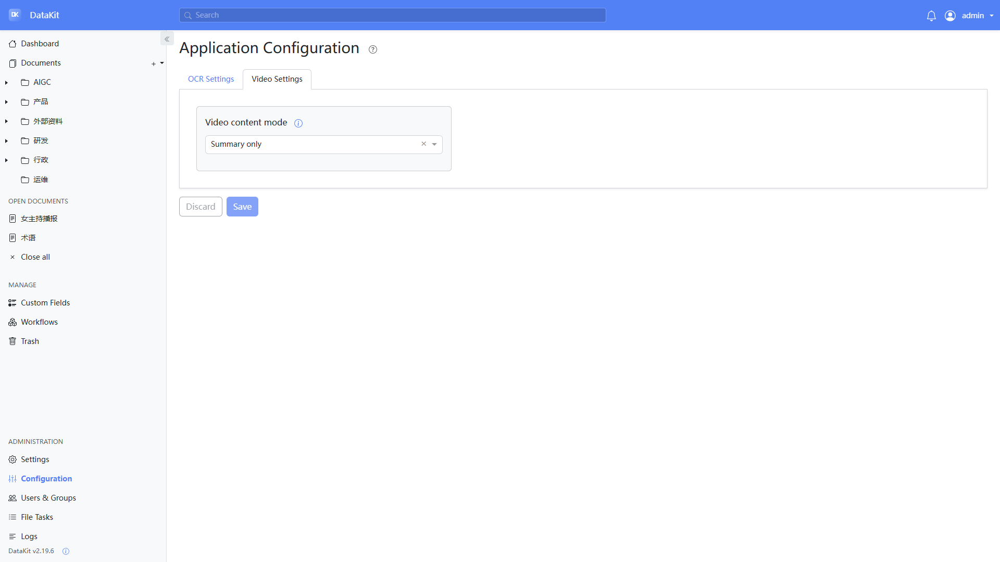
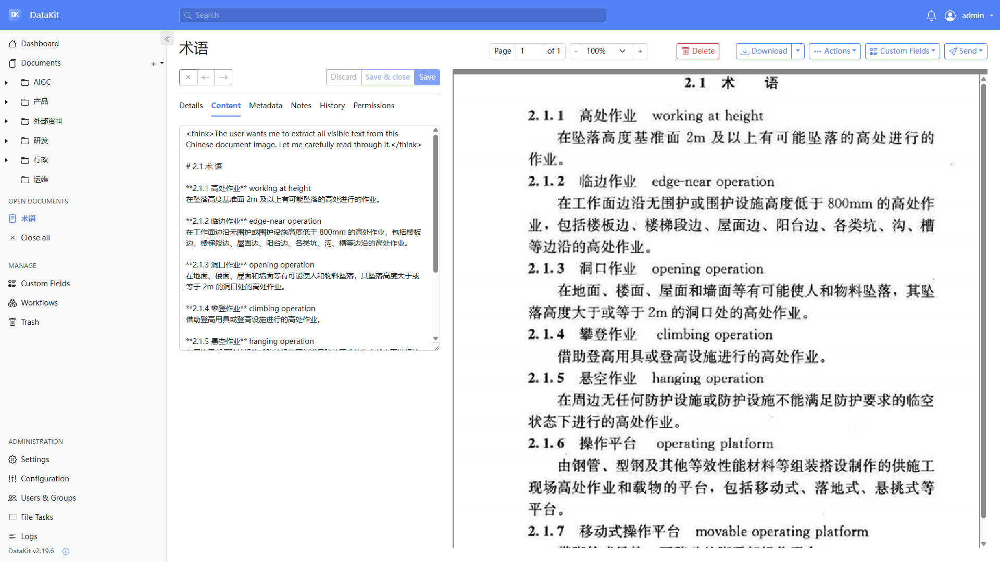
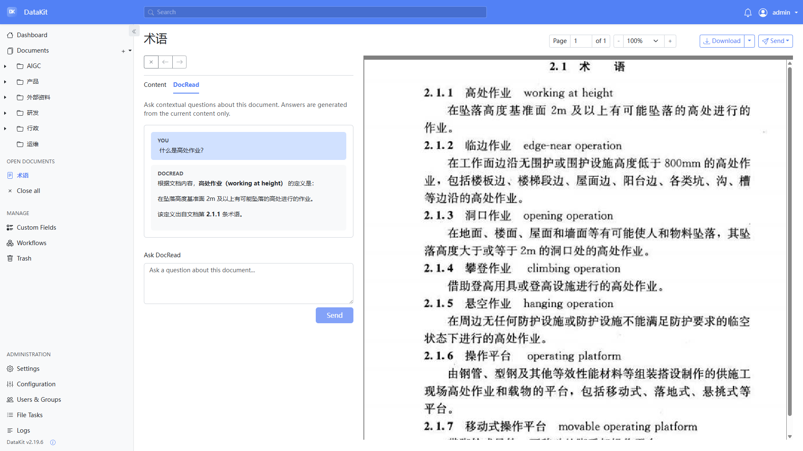
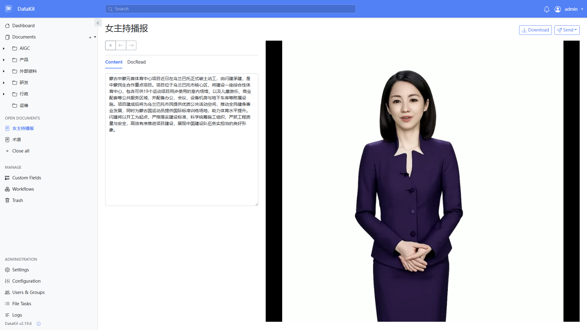

# DataKit

DataKit 是在 [paperless-ngx](https://github.com/paperless-ngx/paperless-ngx) 上继续开发的智能文档系统，当前版本 **2.19.6**。它保留采集、OCR、全文检索、权限和工作流，并接入大语言模型（LLM）、视觉模型（VLM）和语音识别（ASR），用来识别图片、理解视频语音，以及针对单篇文档提问。

界面语言以系统设置为准。下面的截图来自当前运行中的 DataKit。

## 已经可用的能力

| 能力 | 入口 | 说明 |
| --- | --- | --- |
| 仪表盘 | 登录后首页 | 展示多源处理流水线、文档总数、已索引字符数和文件类型分布 |
| 目录树 | 左侧 Documents | 用可嵌套目录组织文档，最多 5 级；选中子目录上传时，父级目录会一并写入标签 |
| 文档库 | Documents | 卡片或表格浏览，支持标题/正文检索，以及标签、通信方、类型、日期等过滤 |
| 图片理解 | Configuration → OCR Settings | 打开 **VLM Image Understanding** 后，图片文字写入文档 Content |
| 文档问答 DocRead | 文档页的 **DocRead** 标签，或卡片上的对话按钮 | 只根据当前文档内容回答，回答以 Markdown 显示 |
| 视频语音 | Configuration → Video Settings | 仅处理 MP4。用 ffmpeg 抽出音轨，经默认 ASR 转写，再按模式写入转写、摘要或两者 |
| 模型与提示词 | Settings → AI Models / AI prompts | 按类型维护默认 LLM、VLM、ASR，以及 DocRead、图像分析和视频摘要提示词 |
| 管理 | 侧栏 | 自定义字段、工作流、回收站、用户与组、文件任务、日志 |

首页流水线还画出了 “LLM Tags”“Embed”“Semantic”。这些是处理目标示意。当前搜索仍是标题和正文的全文检索，系统里没有向量索引；自动打标签来自目录继承和 paperless-ngx 原有的匹配/分类器，不是单独的大模型打标步骤。

## 快速开始

编排文件在 `docker/compose/docker-compose.mariadb-tika.yml`。它会本地构建镜像 `datakit:local`，并一起启动 MariaDB、Redis、Tika 和 Gotenberg。Web 端口映射为 **8008**。

```bash
cd docker/compose
docker compose -f docker-compose.mariadb-tika.yml up -d
```

浏览器打开 `http://<主机>:8008/`。系统里还没有用户时，登录页会引导创建管理员；已有账户则直接登录。



同一目录下会自动出现 `consume`（待导入）和 `export`（导出），数据放在 Docker 卷 `data` 和 `media` 中。

## 登录后的界面

### 仪表盘

首页左侧是来源类型，中间是处理阶段，右侧是文档统计和类型分布。点击 PDF、图片、Office、邮件、视频等来源，会按对应 MIME 类型进入文档列表。


### 目录与文档库

左侧目录就是标签树。在某一级目录上点 **+**，可以新建子目录，或把文件直接上传到该目录。上传到子目录时，文档会带上该目录以及全部上级目录标签。例如上传到 `AIGC / 图片`，文档标签为 `AIGC` 和 `图片`。



### 文档页

打开文档后，左侧维护正文，右侧预览原件。从文档卡片进入对话，或打开 `/documents/<id>/chat`，会看到 **Content** 和 **DocRead** 两个标签。

## 使用前配置

处理图片和视频之前，先配好模型和提示词。每种模型类型同时只有一个默认模型。

### 1. AI 模型

打开 **Settings → AI Models**，分别添加并设为默认：

- **Large language model**：DocRead、视频摘要
- **Vision-language model**：图片文字理解
- **Speech recognition (ASR)**：MP4 语音转写

供应商名称可自由填写（如 `minimax`、`siliconflow`）。需要填写 API 域名、密钥和基础模型名。



### 2. 提示词

打开 **Settings → AI prompts**：

| 提示词 | 用途 |
| --- | --- |
| `DOC_READ` | DocRead 的系统提示词。要求回答限制在当前文档内容内 |
| `VLM_ANALYSIS_IMAGE` | 从图片中提取可见文字 |
| `VIDEO_ASR_SUMMARY` | 把视频转写整理成摘要。内容模式为「仅摘要」或「摘要加转写」时需要填写 |



### 3. OCR 与视频

打开 **Configuration**：

- **OCR Settings**：语言示例为 `chi_sim`。启用 **VLM Image Understanding** 后，图片走视觉模型，而不是只依赖 Tesseract。
- **Video Settings** 的 **Video content mode**：
  - `Transcript only`：只保存转写
  - `Summary only`：只保存摘要
  - `Summary and transcript`：先写 `【摘要】`，再写 `【转写】`

环境变量 `PAPERLESS_VIDEO_CONTENT_MODE` 的默认值是 `both`。配置页里的值优先于环境变量。





视频处理还依赖镜像内的 **ffmpeg**，以及一个默认 ASR 模型。摘要模式再依赖默认 LLM 和 `VIDEO_ASR_SUMMARY`。

## 文档处理示例

### 图片：VLM 写入正文

手机拍摄或版式较复杂的图片，启用 VLM 后，识别结果进入 **Content**，并保留标题、术语和中英对照。下面是一张规范术语页的识别结果，右侧为原图。



### DocRead：针对这一篇提问

在 **DocRead** 中提问时，模型只使用左侧这份正文。可以一边看原件，一边追问定义、条款或摘要。



### 视频：语音转成可检索正文

上传 `video/mp4` 后，标题取文件名，目录标签规则与其他文件相同。下图的实例把 **Video content mode** 设为 `Summary only`，正文是对口播的摘要，右侧是视频画面。



## 文件怎么被处理

上传进入 `POST /api/documents/post_document/`，校验 MIME 后异步消费。主要解析器：

| 解析器 | 文件 | 结果 |
| --- | --- | --- |
| `paperless_tesseract` | PDF、JPEG、PNG、TIFF、HEIC 等 | 默认 OCR 生成可检索 PDF。启用 VLM 时，图片文字由默认视觉模型提取 |
| `paperless_tika` | Word、Excel、PowerPoint、RTF、ODF 等 | Tika 提取文本，Gotenberg 转 PDF |
| `paperless_mail` | `.eml` | 解析邮件头和正文，再转 PDF |
| `paperless_text` | 纯文本、CSV | 直接读取文本 |
| `paperless_video` | `video/mp4` | ffmpeg 抽音频 → ASR → 按模式生成摘要 |

技术栈：后端 Django / Django REST framework，前端 Angular，队列与缓存 Redis，数据库在该编排中为 MariaDB。

## 还没接到产品里的部分

- 向量语义检索，以及和关键词、元数据混在一起的混合检索
- 把音频文件当作和 MP4 一样的独立解析类型。首页的 Audio 入口目前只是按 MIME 筛选
- 右下角全局助手、跨文档问答

## 许可证

GNU GPLv3，见仓库 `LICENSE`。DataKit 建立在 paperless-ngx 及其贡献者的工作之上。
