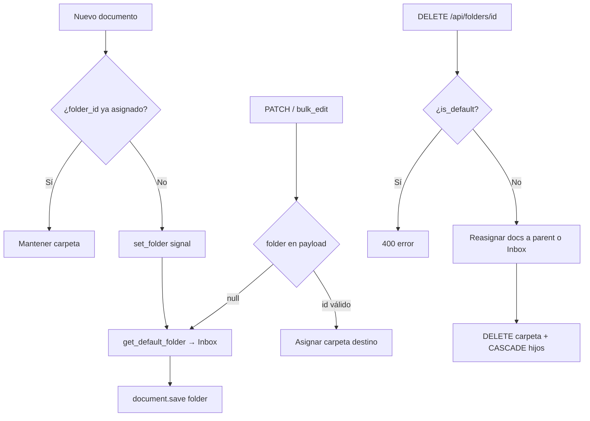

# Folders — documentación de implementación y mantenimiento

Esta guía documenta la funcionalidad de **navegación por carpetas** añadida a este fork de Paperless-ngx. Está pensada para desarrolladores que mantengan, extiendan o depuren la feature.

## Resumen

La feature introduce una **segunda forma de organizar documentos**, centrada en una jerarquía de carpetas navegable (experiencia tipo explorador de archivos), sin sustituir tags, correspondents, document types ni storage paths.

| Aspecto | Comportamiento |
|--------|----------------|
| Entidad | `Folder` (modelo Django nuevo) |
| Relación con documentos | `Document.folder` (FK nullable en BD, **siempre rellena en la práctica**) |
| Carpeta por defecto | **Inbox** (`is_default=True`), creada on-demand |
| Mover documento | Cambio **lógico** (solo FK); **no** mueve archivos en disco |
| Storage path | **Independiente**; sigue gobernando la ruta física |

## Decisión de arquitectura

### Por qué no reutilizar `StoragePath`

En Paperless, `StoragePath.path` es una **plantilla Jinja2** que `generate_filename()` renderiza para decidir dónde se escribe el archivo. Cambiar un storage path puede disparar `update_filename_and_move_files()` (movimiento físico real).

Las carpetas del usuario deben ser:

- entidades **visibles y editables** (crear, renombrar, anidar, borrar),
- **independientes** del layout físico,
- navegables como árbol sin efectos colaterales en disco.

Por eso se eligió un modelo explícito `Folder` (Opción A), alineado con cómo tags y correspondents son capas lógicas de metadatos.

### Separación lógica vs. física

```
Usuario organiza documentos  →  Folder (lógico, FK en Document)
Sistema almacena archivos    →  StoragePath + filename format (físico)
```

Mantener esta separación es un **invariante de diseño**. Cualquier cambio futuro que sincronice carpeta con ruta en disco debe ser explícito, opt-in y documentado.

## Modelo de datos

### `Folder` (`src/documents/models.py`)

| Campo | Tipo | Notas |
|-------|------|-------|
| `name` | `CharField(128)` | Nombre visible |
| `parent` | FK self, `CASCADE` | `null` = carpeta raíz |
| `is_default` | `BooleanField` | Marca la carpeta **Inbox** |
| `owner` | FK `User`, nullable | Hereda de `ModelWithOwner` |

**Restricciones:**

- Unicidad: `(name, parent, owner)` — mismo nombre permitido bajo padres distintos.
- Profundidad máxima: `MAX_NESTING_DEPTH = 10` (validado en `Folder.clean()`).
- Sin ciclos: no puede ser padre de sí misma ni de un descendiente.

**Métodos útiles:**

- `full_path` — ruta legible (`Personal/Taxes/2023`).
- `get_ancestors()` / `get_descendants()` — recorrido del árbol.

### `Document.folder`

```python
folder = models.ForeignKey(
    Folder,
    blank=True,
    null=True,
    related_name="documents",
    on_delete=models.SET_NULL,
)
```

Aunque el FK admite `NULL` en esquema (compatibilidad y `SET_NULL` al borrar carpeta sin lógica de reasignación), la aplicación **garantiza** que todo documento tenga carpeta mediante migración, señal, serializer y bulk edit.

### Carpeta por defecto

```python
get_default_folder()  # crea "Inbox" con is_default=True si no existe
get_default_folder_id()
```

Puntos de uso:

1. Migración `0022` — backfill de documentos existentes.
2. Señal `document_consumption_finished` → handler `set_folder`.
3. `DocumentSerializer.validate()` — `folder=None` en input → Inbox.
4. `bulk_edit.set_folder()` — `folder=None` → Inbox.
5. `FolderViewSet.destroy()` — destino al borrar carpeta raíz.

## Migración

**Archivo:** `src/documents/migrations/0022_folder_document_folder.py`

1. Crea el modelo `Folder` y el constraint de unicidad.
2. Añade `Document.folder`.
3. `RunPython`: crea Inbox si no existe y asigna **todos** los documentos con `folder IS NULL` (incluye soft-deleted).

La migración es **idempotente** en el backfill de Inbox. Al revertir, se elimina la columna; no hay undo de datos.

**Tests:** `src/documents/tests/test_migration_folders.py`

## Backend — mapa de archivos

| Archivo | Responsabilidad |
|---------|-----------------|
| `models.py` | `Folder`, `get_default_folder()`, FK en `Document` |
| `migrations/0022_*.py` | Esquema + backfill |
| `serialisers.py` | `FolderSerializer`, `FolderField`, validación en `DocumentSerializer`, `BulkEditSerializer.set_folder` |
| `views.py` | `FolderViewSet` (árbol en list, borrado seguro) |
| `filters.py` | `FolderFilterSet`, filtros `folder*` en `DocumentFilterSet` |
| `bulk_edit.py` | `set_folder(doc_ids, folder)` |
| `signals/handlers.py` | `set_folder` al consumir documento |
| `apps.py` | Conexión de la señal |
| `urls.py` | Registro `r"folders"` |
| `management/commands/document_exporter.py` | Incluye `folders` en el manifest |

### API REST — `/api/folders/`

Sigue los mismos patrones que tags/correspondents:

- `ModelViewSet` + `OwnedObjectSerializer`
- Permisos: `PaperlessObjectPermissions` + `ObjectOwnedOrGrantedPermissionsFilter`
- Paginación: `StandardPagination`
- `document_count` anotado (como otros modelos con conteo)

**Filtros (`FolderFilterSet`):**

| Parámetro | Descripción |
|-----------|-------------|
| `is_root=true` | Solo carpetas sin padre (usado por el frontend para el árbol) |
| `name`, `parent__id`, `is_default` | Filtros estándar |

**Listado con hijos anidados:**

`FolderViewSet.list()` construye `_folder_children_map` (mapa `parent_id → [hijos]`) para que `FolderSerializer.get_children()` serialice el árbol sin N+1 queries por carpeta.

**Borrado (`destroy`):**

1. Rechaza borrar la carpeta `is_default`.
2. Reasigna documentos de la carpeta y **todos sus descendientes** al padre (o Inbox si es raíz).
3. Elimina la carpeta (CASCADE elimina subcarpetas).

### API — documentos

- `GET /api/documents/?folder__id=<id>` — documentos de una carpeta.
- `PATCH /api/documents/<id>/` — campo `folder` (nunca queda `null` tras validación).
- `POST /api/documents/bulk_edit/` — método `set_folder` con parámetro `folder` (id o `null` → Inbox).

### Serializer — detalle de mantenimiento

`FolderSerializer` **desactiva** los validadores auto-generados de `unique_together`:

```python
def get_unique_together_validators(self):
    return []
```

Motivo: el constraint del modelo es `(name, parent, owner)`, pero DRF generaría un `UniqueTogetherValidator` que exige `parent` como campo requerido, impidiendo crear carpetas raíz sin enviar `parent: null` explícitamente. La unicidad parent-aware se valida manualmente en `validate()`.

Al modificar el serializer, **no eliminar** este override sin probar `POST /api/folders/` con solo `{"name": "..."}`.

### Bulk edit

`set_folder` hace un `qs.update(folder=...)` **sin** llamar a `bulk_update_documents.apply_async`, porque no afecta archivos físicos ni índice de búsqueda de forma distinta a un PATCH individual del FK.

Si en el futuro la carpeta afectara rutas físicas, habría que reevaluar si encolar reprocesado.

## Frontend — mapa de archivos

| Archivo | Responsabilidad |
|---------|-----------------|
| `data/folder.ts` | Interfaz TypeScript |
| `services/rest/folder.service.ts` | API client; `getTree()` → `?is_root=true` |
| `services/rest/document.service.ts` | Tipo `set_folder` en bulk edit |
| `services/permissions.service.ts` | `PermissionType.Folder` |
| `components/folders/` | Vista principal del explorador |
| `components/common/edit-dialog/folder-edit-dialog/` | Crear/editar carpeta |
| `app-routing.module.ts` | Rutas `/folders`, `/folders/:id` |
| `app-frame.component.html` | Entrada en sidebar |
| `main.ts` | Iconos Bootstrap (`inbox`, `folderPlus`, etc.) |

### Rutas y permisos

- `/folders` — abre Inbox o primera carpeta raíz visible.
- `/folders/:id` — carpeta concreta.
- `PermissionsGuard` exige `PermissionType.Folder` (view).

### `FoldersComponent`

Responsabilidades:

- Cargar árbol (`folderService.getTree()`), aplanar para sidebar y menús.
- Navegar por ruta (`ActivatedRoute` param `id`).
- Listar documentos paginados (`documentService` con filtro `folder__id`).
- CRUD de carpetas (modal `FolderEditDialogComponent`).
- Selección múltiple + mover (`bulk_edit` `set_folder`).
- Drag & drop HTML5 de documentos sobre carpetas del árbol.

Patrones reutilizados: `LoadingComponentWithPermissions`, `PageHeaderComponent`, `ConfirmButtonComponent`, `*pngxIfPermissions`.

## Permisos

Django crea automáticamente: `add_folder`, `view_folder`, `change_folder`, `delete_folder`.

En el frontend, `PermissionType.Folder = '%s_folder'` sigue el mismo patrón que tags o storage paths.

**Al añadir tests de permisos globales** que listen todos los `PermissionType`, incluir los cuatro permisos de folder en la lista de grants del usuario de prueba (ver `permissions.service.spec.ts`).

## Export / import

`document_exporter.py` incluye `"folders": Folder.objects.all()` en el manifest, **antes** de documentos, para que el FK `Document.folder` resuelva al importar.

Si se añaden campos a `Folder`, actualizar exporter/importer y los tests en `test_management_exporter.py`.

## Tests

### Backend

```bash
cd src
pytest documents/tests/test_folders.py \
       documents/tests/test_api_folders.py \
       documents/tests/test_migration_folders.py -q
```

Cobertura principal:

| Área | Tests |
|------|-------|
| Modelo | default folder, jerarquía, ciclos, profundidad |
| Señal | asignación Inbox al consumir |
| Bulk edit | uno, varios, fallback a default |
| API | CRUD, árbol, unicidad, borrado, permisos, bulk |
| Migración | backfill + reverse de columna |

**Nota para tests:** la migración `0022` puede dejar Inbox en la BD de test. Tests que asumen `Folder.objects.count() == 0` deben limpiar explícitamente o tener en cuenta la carpeta por defecto.

### Frontend

```bash
cd src-ui
ng test --test-path-patterns=folder
ng test --test-path-patterns=permissions.service
```

Archivos: `folders.component.spec.ts`, `folder.service.spec.ts`.

## Invariantes (no romper)

1. **Todo documento tiene carpeta** — cualquier camino de creación/actualización debe terminar con `folder_id` válido.
2. **Inbox no se borra** — `FolderViewSet.destroy` y UI deben respetarlo.
3. **Borrar carpeta no deja documentos huérfanos** — reasignar antes de CASCADE.
4. **Mover documento no mueve disco** — salvo decisión explícita futura.
5. **Folder ≠ StoragePath** — no mezclar responsabilidades sin rediseño.
6. **Unicidad parent-aware** — no reactivar validadores DRF que exijan `parent` obligatorio.

## Guía para cambios futuros

### Añadir un campo a `Folder`

1. Modelo + migración.
2. `FolderSerializer.Meta.fields`.
3. `data/folder.ts` y formulario en `folder-edit-dialog`.
4. Tests API + modelo.
5. Exporter manifest (si aplica).

### Cambiar comportamiento al mover documentos

Si se requiere sincronizar con storage path o mover archivos:

1. Revisar `bulk_edit.set_folder` y PATCH individual en `DocumentSerializer.update`.
2. Evaluar `update_filename_and_move_files()` y `bulk_update_documents`.
3. Documentar aquí la nueva semántica y ampliar tests de integración.

### Mejorar rendimiento del árbol

El listado actual hace una query para el mapa de hijos + serialización recursiva. Para árboles muy grandes:

- limitar profundidad en API,
- endpoint dedicado `/api/folders/tree/`,
- o precargar con `prefetch_related` / CTE según volumen.

### Integrar carpetas en otras vistas

Puntos de extensión naturales:

- Filtro `folder` en la vista de documentos principal (ya existe en API: `folder__id`).
- Columna o badge de carpeta en tablas de documentos.
- Workflows: acción `assign_folder` (no implementado).

## Limitaciones conocidas

| Limitación | Impacto |
|------------|---------|
| Carpeta y storage path independientes | Mover de carpeta no cambia ruta en disco |
| Permiso de mover doc | Valida cambio sobre documento, no visibilidad de carpeta destino |
| `full_path` en serializer | O(N × profundidad) al construir árbol grande |
| Sin drag & drop de carpetas | Solo documentos |
| Un solo `is_default` | No hay lógica para múltiples Inbox; `get_default_folder()` toma la de menor `pk` |

## Lista de archivos tocados

### Backend (modificados)

- `src/documents/models.py`
- `src/documents/serialisers.py`
- `src/documents/views.py`
- `src/documents/filters.py`
- `src/documents/bulk_edit.py`
- `src/documents/signals/handlers.py`
- `src/documents/apps.py`
- `src/documents/management/commands/document_exporter.py`
- `src/paperless/urls.py`

### Backend (nuevos)

- `src/documents/migrations/0022_folder_document_folder.py`
- `src/documents/tests/test_folders.py`
- `src/documents/tests/test_api_folders.py`
- `src/documents/tests/test_migration_folders.py`

### Frontend (modificados)

- `src-ui/src/app/app-routing.module.ts`
- `src-ui/src/app/components/app-frame/app-frame.component.html`
- `src-ui/src/app/data/document.ts`
- `src-ui/src/app/services/permissions.service.ts`
- `src-ui/src/app/services/permissions.service.spec.ts`
- `src-ui/src/app/services/rest/document.service.ts`
- `src-ui/src/main.ts`

### Frontend (nuevos)

- `src-ui/src/app/data/folder.ts`
- `src-ui/src/app/services/rest/folder.service.ts`
- `src-ui/src/app/services/rest/folder.service.spec.ts`
- `src-ui/src/app/components/folders/` (component + template + styles + spec)
- `src-ui/src/app/components/common/edit-dialog/folder-edit-dialog/`

## Diagrama de flujo (asignación de carpeta)



## Checklist de revisión (PR / cambios)

- [ ] ¿Se mantiene el invariante “todo documento con carpeta”?
- [ ] ¿Migración reversible y backfill seguro?
- [ ] ¿Tests backend y frontend actualizados?
- [ ] ¿Permisos en frontend spec si se toca `PermissionType`?
- [ ] ¿Exporter incluye cambios de modelo?
- [ ] ¿`get_unique_together_validators` intacto en `FolderSerializer`?
- [ ] ¿Documentación de esta página actualizada?

---

*Última revisión: alineada con la migración `0022` y la UI en `/folders`.*
