

{.index-logo}
{.index-logo}

**Paperless-ngx** is a _community-supported_ open-source document management system that transforms your
physical documents into a searchable online archive so you can keep, well, _less paper_.

[Get started](/setup/){ .md-button .md-button--primary .index-callout }
[Demo](https://demo.paperless-ngx.com){ .md-button .md-button--secondary }

{.index-screenshot}
{.index-screenshot}

## Why This Exists

Paper is a nightmare. Environmental issues aside, there's no excuse for
it in the 21st century. It takes up space, collects dust, doesn't
support any form of a search feature, indexing is tedious, it's heavy
and prone to damage & loss.

This software is designed to make "going paperless" easier. No more worrying
about finding stuff again, feed documents right from the post box into
the scanner and then shred them. Perhaps you might find it useful too.

## Paperless, a history

Paperless is a simple Django application running in two parts: a
_Consumer_ (the thing that does the indexing) and the _Web server_ (the
part that lets you search & download already-indexed documents). If you
want to learn more about its functions keep on reading after the
installation section.

Paperless-ngx is a document management system that transforms your
physical documents into a searchable online archive so you can keep,
well, _less paper_.

Paperless-ngx forked from paperless-ng to continue the great work and
distribute responsibility of supporting and advancing the project among
a team of people.

NG stands for both Angular (the framework used for the Frontend) and
next-gen. Publishing this project under a different name also avoids
confusion between paperless and paperless-ngx.

If you want to learn about what's different in paperless-ngx from
Paperless, check out these resources in the documentation:

- [Some screenshots](#screenshots) of the new UI are available.
- Read [this section](/advanced_usage/#advanced-automatic_matching) if you want to learn about how paperless automates all
  tagging using machine learning.
- Paperless now comes with a [proper email consumer](/usage/#usage-email) that's fully tested and production ready.
- Paperless creates searchable PDF/A documents from whatever you put into the consumption directory. This means
  that you can select text in image-only documents coming from your scanner.
- See [this note](/administration/#utilities-encyption) about GnuPG encryption in paperless-ngx.
- Paperless is now integrated with a
  [task processing queue](/setup#task_processor) that tells you at a glance when and why something is not working.
- The [changelog](/changelog) contains a detailed list of all changes in paperless-ngx.

## Screenshots

This is what Paperless-ngx looks like.

The dashboard shows customizable views on your document and allows
document uploads:

The document list provides three different styles to scroll through your
documents:

[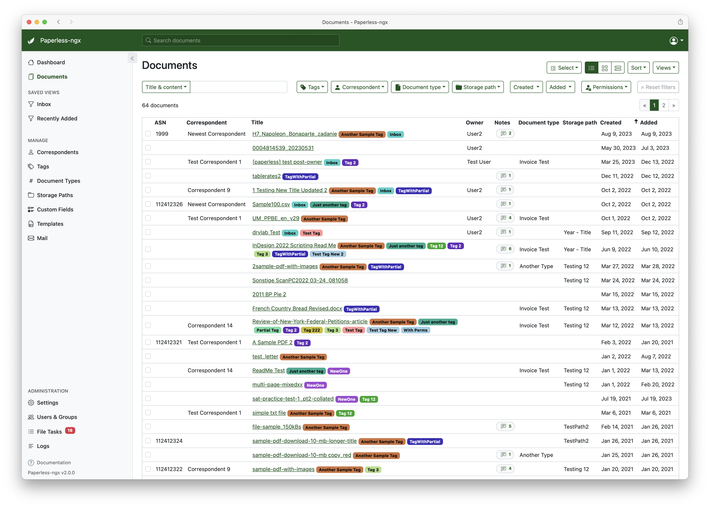](assets/screenshots/documents-table.png)

[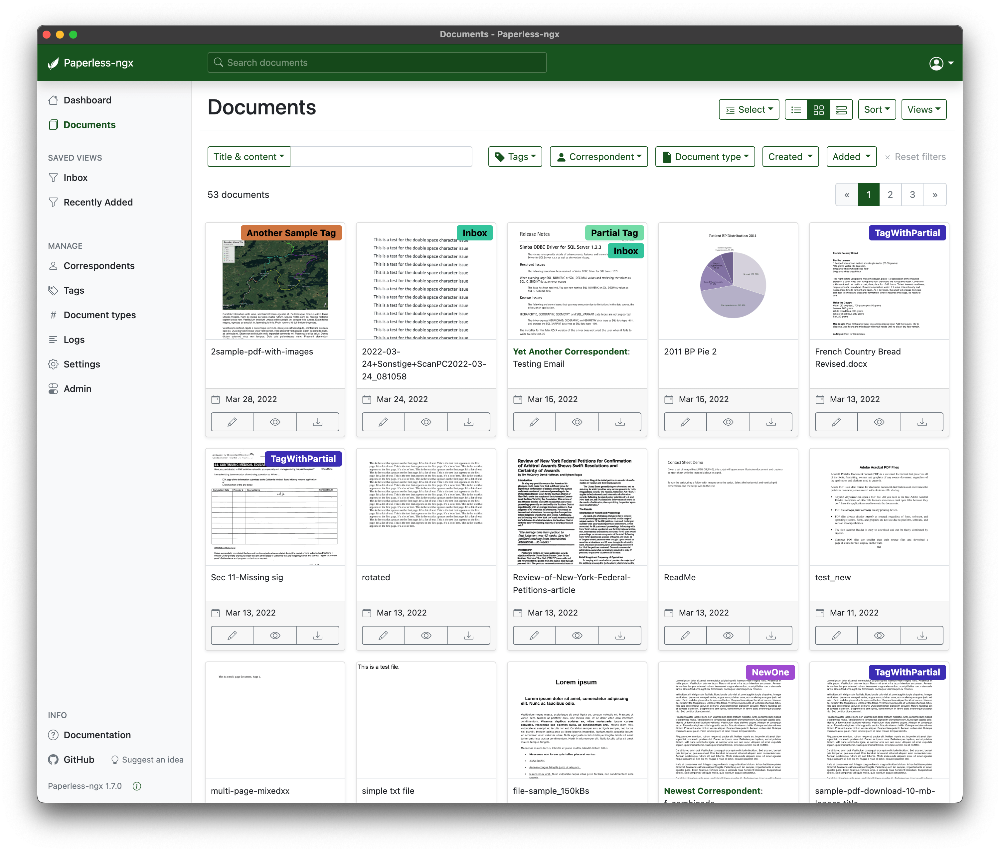](assets/screenshots/documents-smallcards.png)

[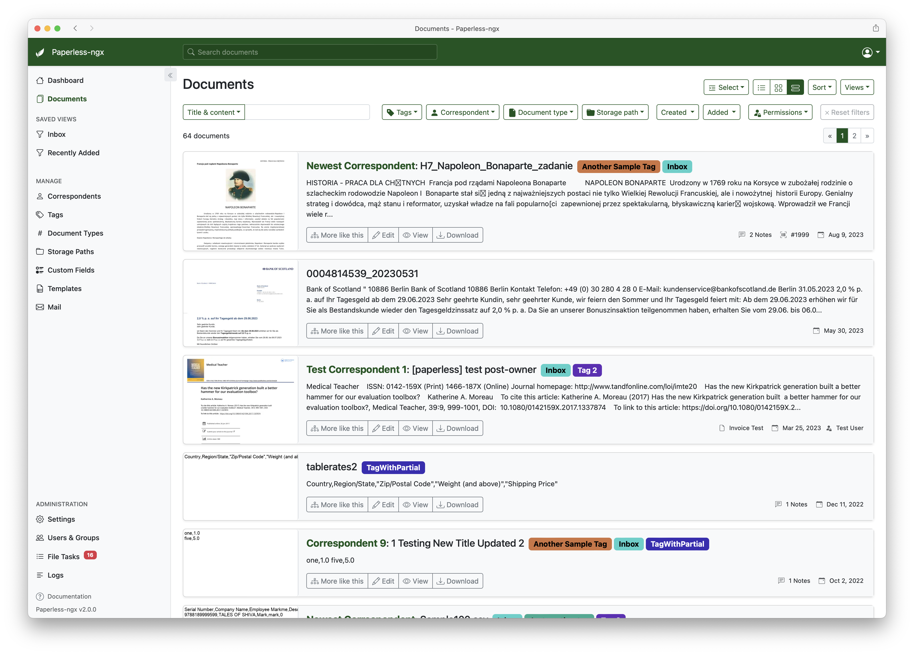](assets/screenshots/documents-largecards.png)

Paperless-ngx also supports dark mode:

[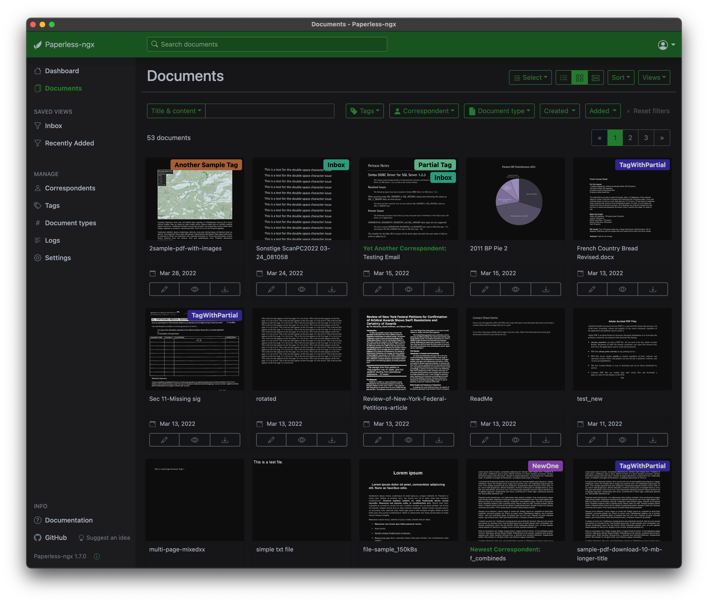](assets/screenshots/documents-smallcards-dark.png)

Extensive filtering mechanisms:

[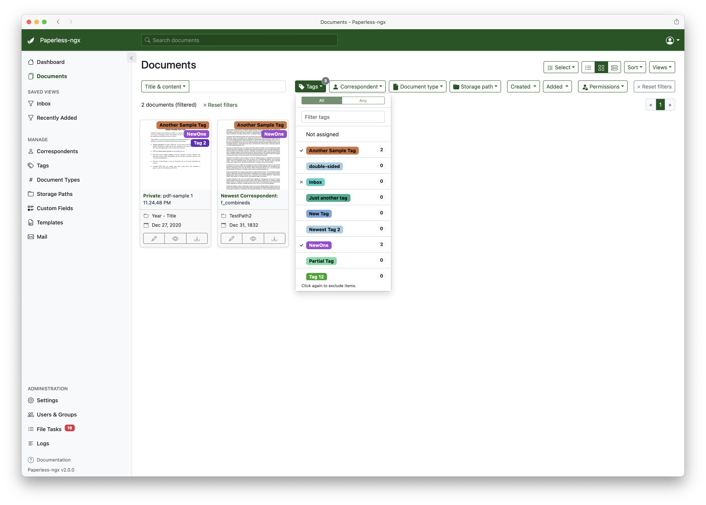](assets/screenshots/documents-filter.png)

Bulk editing of document tags, correspondents, etc.:

[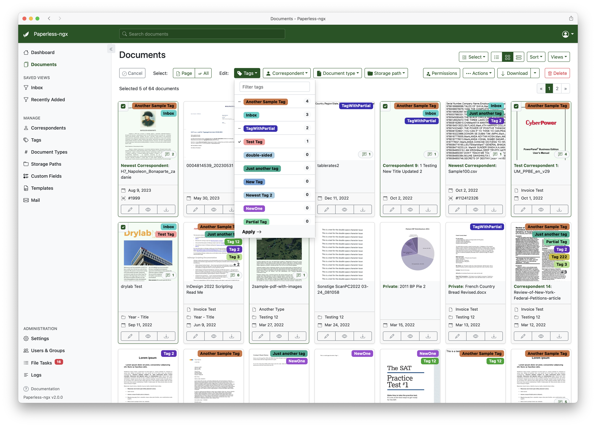](assets/screenshots/bulk-edit.png)

Side-by-side editing of documents:

Tag editing. This looks about the same for correspondents and document
types.

[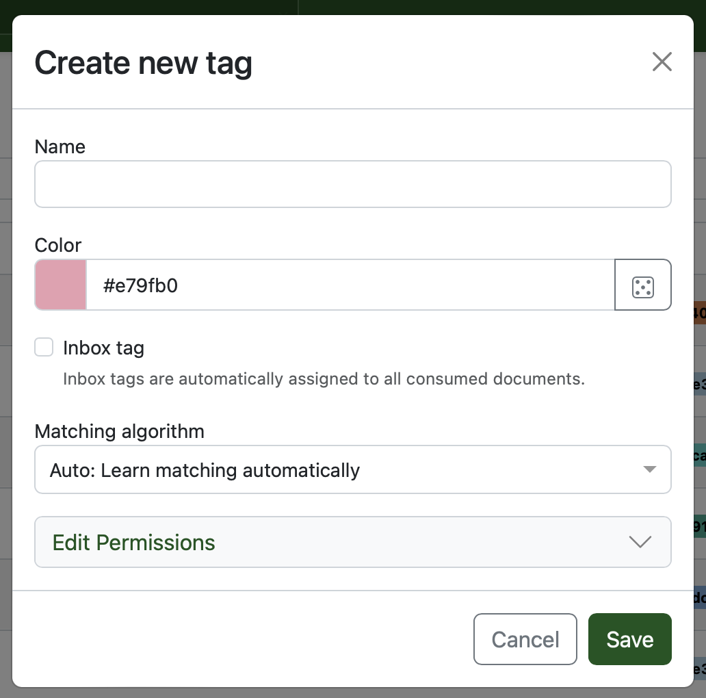](assets/screenshots/new-tag.png)

Searching provides auto complete and highlights the results.

[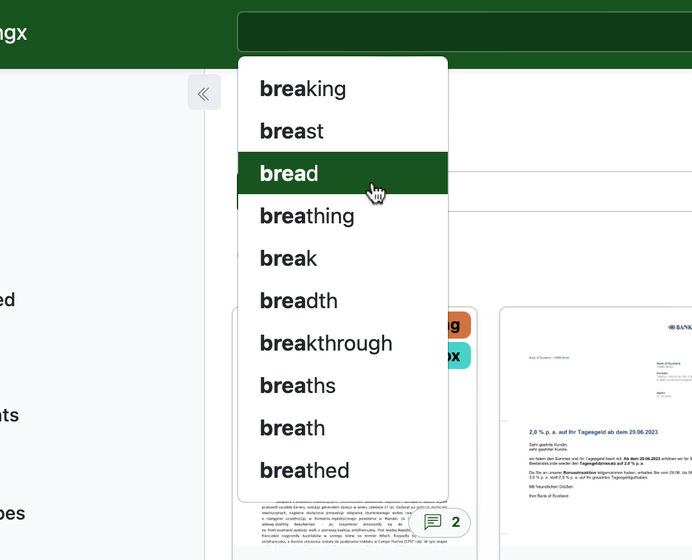](assets/screenshots/search-preview.png)

[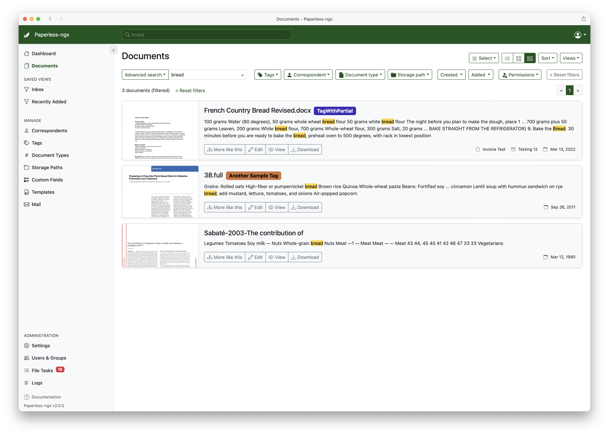](assets/screenshots/search-results.png)

Fancy mail filters!

[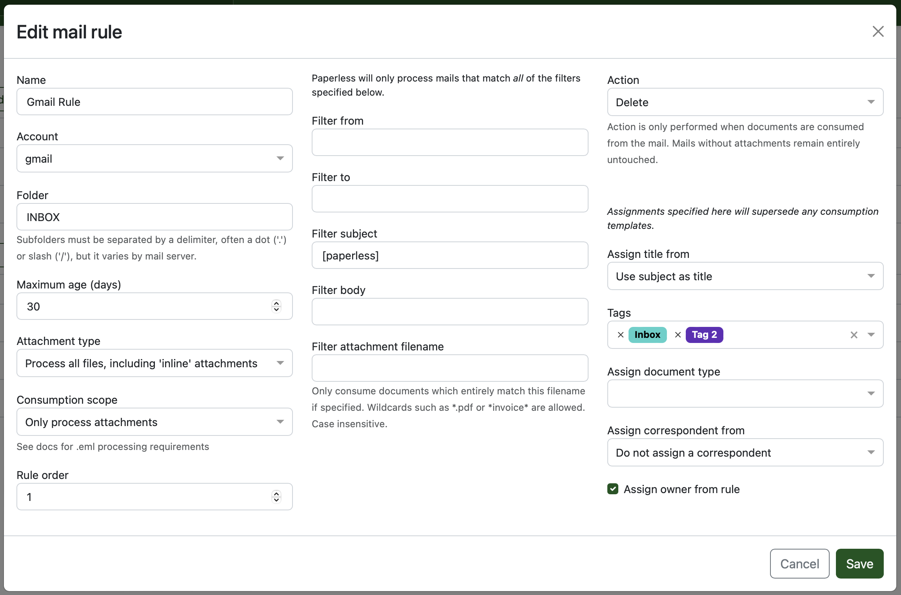](assets/screenshots/mail-rules-edited.png)

Mobile devices are supported.

[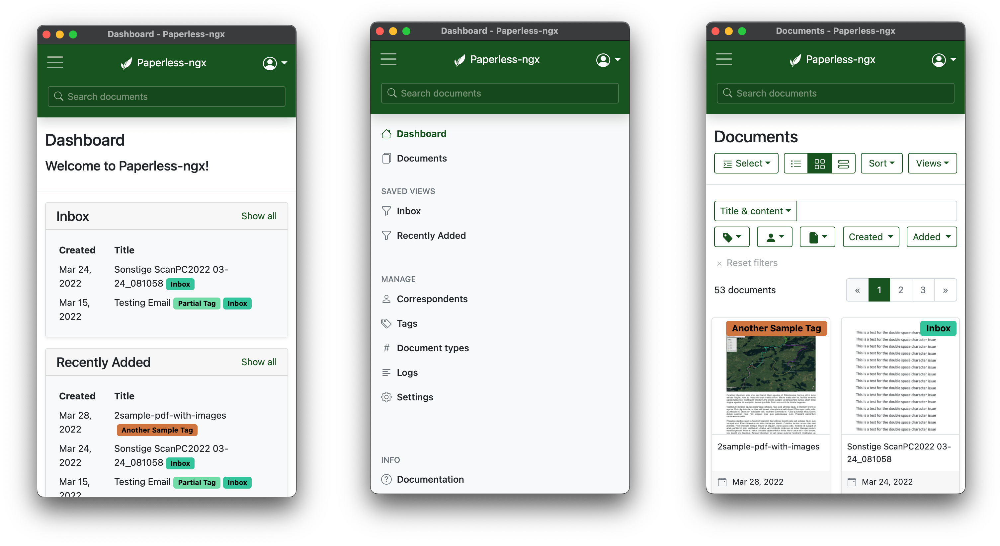](assets/screenshots/mobile.png)

## Support

Community support is available via [GitHub Discussions](https://github.com/paperless-ngx/paperless-ngx/discussions/) and [the Matrix chat room](https://matrix.to/#/#paperless:matrix.org).

### Feature Requests

Feature requests can be submitted via [GitHub Discussions](https://github.com/paperless-ngx/paperless-ngx/discussions/categories/feature-requests) where you can search for existing ideas, add your own and vote for the ones you care about.

### Bugs

For bugs please [open an issue](https://github.com/paperless-ngx/paperless-ngx/issues) or [start a discussion](https://github.com/paperless-ngx/paperless-ngx/discussions/categories/support) if you have questions.

## Contributing

People interested in continuing the work on paperless-ngx are encouraged to reach out on [GitHub](https://github.com/paperless-ngx/paperless-ngx) or [the Matrix chat room](https://matrix.to/#/#paperless:matrix.org). If you would like to contribute to the project on an ongoing basis there are multiple teams (frontend, ci/cd, etc) that could use your help so please reach out!

### Translation

Paperless-ngx is available in many languages that are coordinated on [Crowdin](https://crwd.in/paperless-ngx). If you want to help out by translating paperless-ngx into your language, please head over to https://crwd.in/paperless-ngx, and thank you!

## Scanners & Software

Paperless-ngx is compatible with many different scanners and scanning tools. A user-maintained list of scanners and other software is available on [the wiki](https://github.com/paperless-ngx/paperless-ngx/wiki/Scanner-&-Software-Recommendations).
