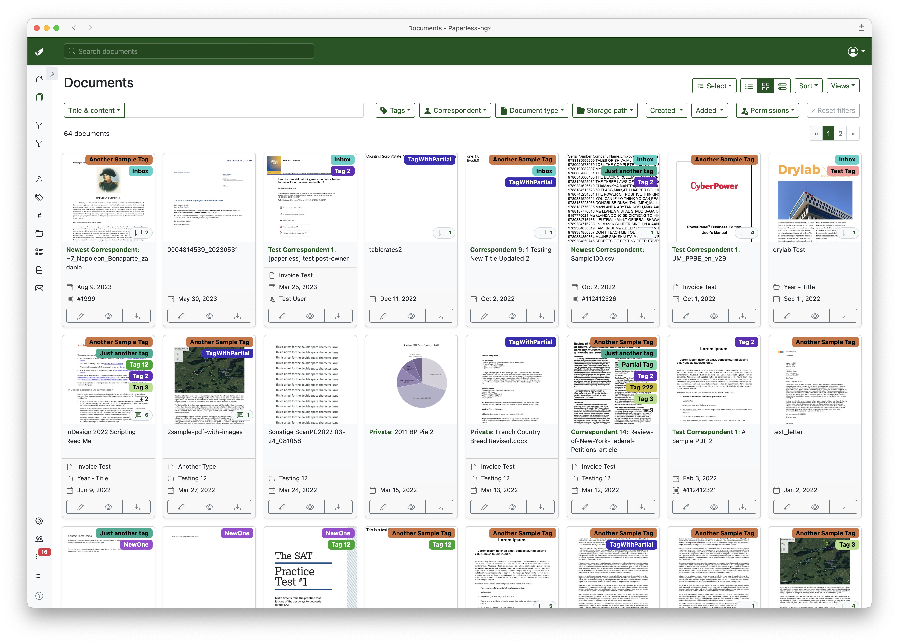
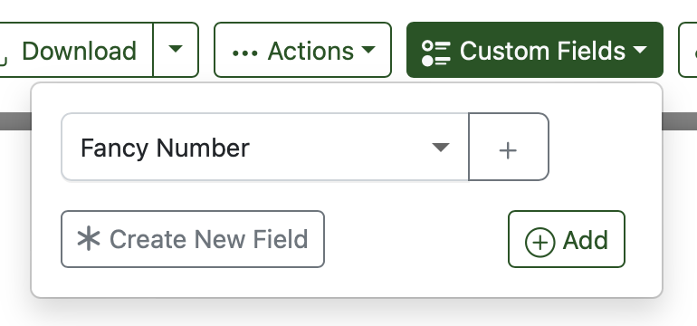
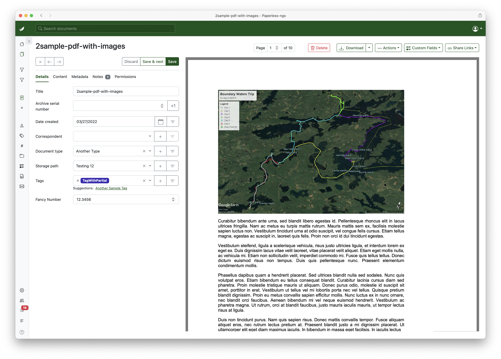
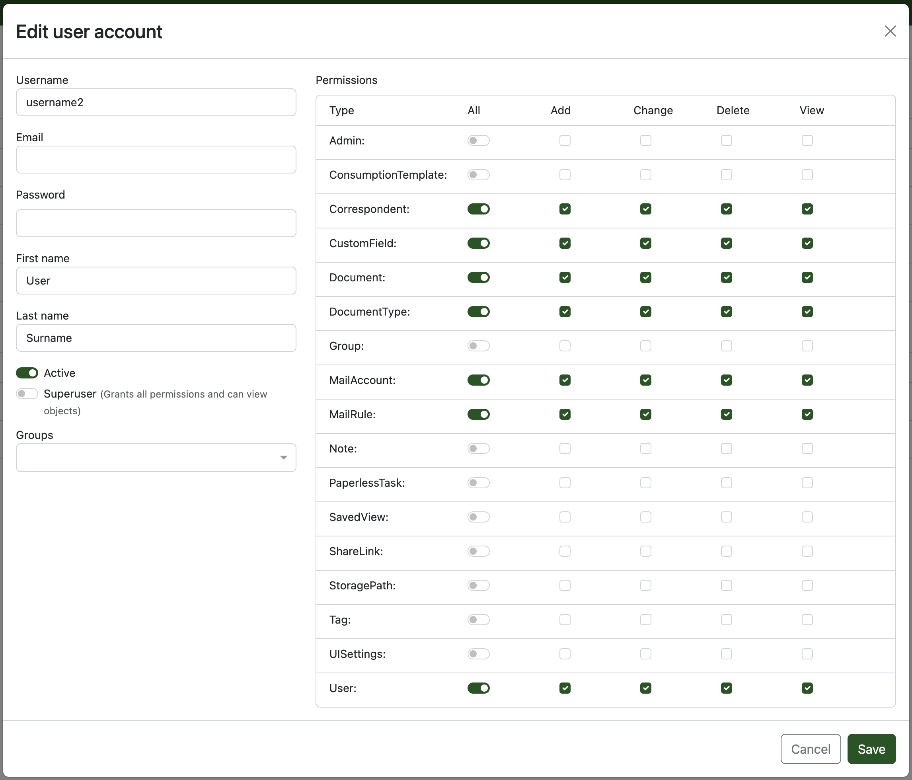
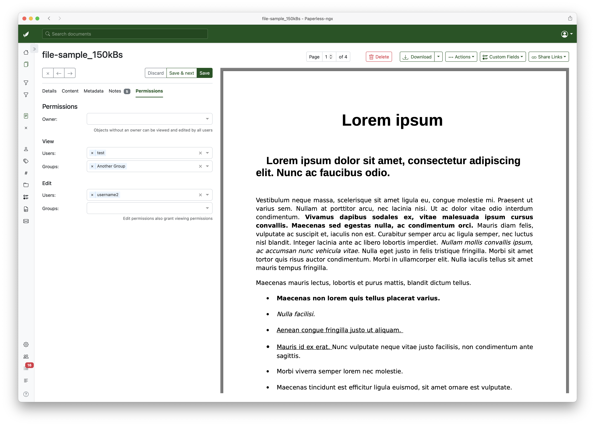
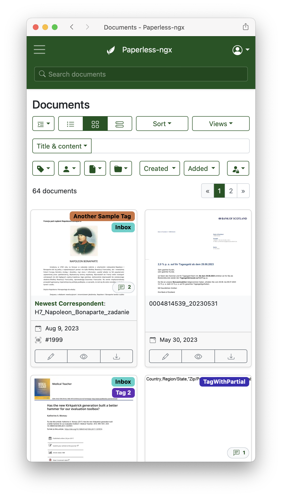
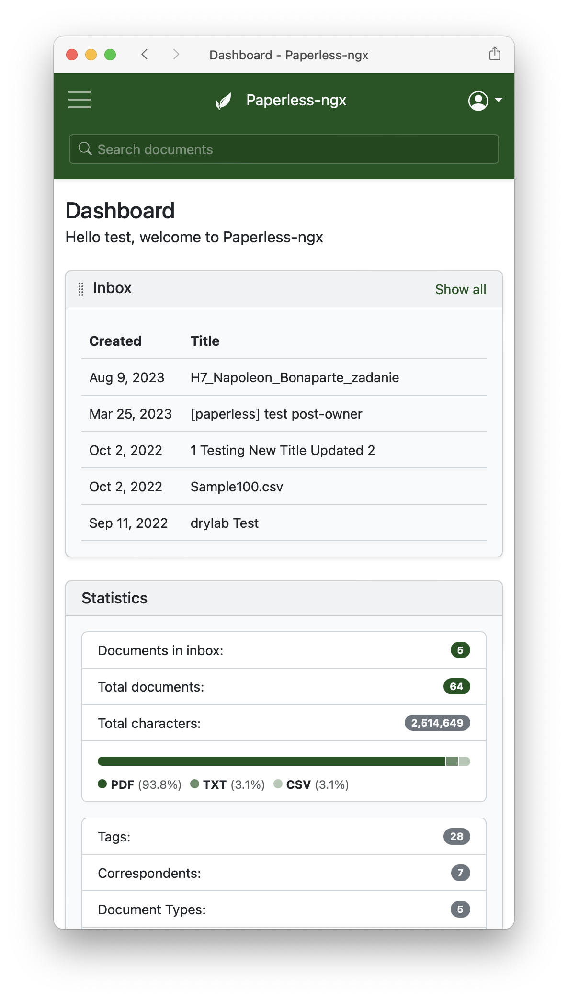

{.index-logo}
{.index-logo}

**Paperless-ngx** is a _community-supported_ open-source document management system that transforms your
physical documents into a searchable online archive so you can keep, well, _less paper_.

[Get started](setup.md){ .md-button .md-button--primary .index-callout }
[Demo](https://demo.paperless-ngx.com){ .md-button .md-button--secondary target=\_blank }

{.index-screenshot}
{.index-screenshot}

## Features

-   **Organize and index** your scanned documents with tags, correspondents, types, and more.
-   Performs **OCR** on your documents, adding selectable text to image-only documents.
-   Uses machine-learning to automatically add tags, correspondents and document types to your documents.
-   Supports PDF documents, images, plain text files, Office documents (Word, Excel, Powerpoint, and LibreOffice equivalents)[^1] and more.
-   Paperless stores your documents plain on disk. Filenames and folders are managed by paperless and their format can be configured freely with different configurations assigned to different documents.
-   **Beautiful, modern web application** that features:
    -   Customizable dashboard with statistics.
    -   Filtering by tags, correspondents, types, and more.
    -   Bulk editing of tags, correspondents, types and more.
    -   Drag-and-drop uploading of documents throughout the app.
    -   Customizable views can be saved and displayed on the dashboard and / or sidebar.
    -   Support for custom fields of various data types.
    -   Shareable public links with optional expiration.
-   **Full text search** helps you find what you need:
    -   Auto completion suggests relevant words from your documents.
    -   Results are sorted by relevance to your search query.
    -   Highlighting shows you which parts of the document matched the query.
    -   Searching for similar documents ("More like this")
-   **Email processing**[^1]: import documents from your email accounts:
    -   Configure multiple accounts and rules for each account.
    -   After processing, paperless can perform actions on the messages such as marking as read, deleting and more.
-   A built-in robust **multi-user permissions** system that supports 'global' permissions as well as per document or object.
-   A powerful templating system that gives you more control over the consumption pipeline.
-   **Optimized** for multi core systems: Paperless-ngx consumes multiple documents in parallel.
-   The integrated sanity checker makes sure that your document archive is in good health.

[^1]: Office document and email consumption support is optional and provided by Apache Tika (see [configuration](https://docs.paperless-ngx.com/configuration/#tika))

## Paperless, a history

Paperless-ngx is the official successor to the original [Paperless](https://github.com/the-paperless-project/paperless) & [Paperless-ng](https://github.com/jonaswinkler/paperless-ng) projects and is designed to continue the great work and distribute responsibility of supporting and advancing the project among a team of people. [Consider joining us!](https://github.com/paperless-ngx/paperless-ngx#community-support)

Further discussion of the transition between these projects can be found at
[ng#1599](https://github.com/jonaswinkler/paperless-ng/issues/1599) and [ng#1632](https://github.com/jonaswinkler/paperless-ng/issues/1632).

## Screenshots

Paperless-ngx aims to be as nice to use as it is useful. Check out some screenshots below.

The dashboard shows saved views which can be sorted. Documents can be uploaded with the button or dropped anywhere in the application:

The document list provides three different styles to browser your documents:

Use the 'slim' sidebar to focus on just your docs:

Paperless-ngx also supports dark mode:

Quickly find documents with extensive filtering mechanisms:

Bulk edit document tags, correspondents, etc. as well as permissions:

Side-by-side editing of documents:

Support for custom fields:

{: style="width:50%; margin-left: 25%"}

A robust permissions system with support for 'global' and document / object permissions:

{: style="width:50%; margin-left: 25%"}

Tag editing. This looks about the same for correspondents and document
types.

{: style="width:50%; margin-left: 25%"}

Searching provides auto complete and highlights the results.

{: style="width:50%; margin-left: 25%"}

Fancy mail filters!

{: style="width:80%; margin-left: 10%"}

Mobile devices are supported.

{: style="width:33%"}
{: style="width:33%"}
{: style="width:33%"}

## Support

Community support is available via [GitHub Discussions](https://github.com/paperless-ngx/paperless-ngx/discussions/) and [the Matrix chat room](https://matrix.to/#/#paperless:matrix.org).

### Feature Requests

Feature requests can be submitted via [GitHub Discussions](https://github.com/paperless-ngx/paperless-ngx/discussions/categories/feature-requests) where you can search for existing ideas, add your own and vote for the ones you care about.

### Bugs

For bugs please [open an issue](https://github.com/paperless-ngx/paperless-ngx/issues) or [start a discussion](https://github.com/paperless-ngx/paperless-ngx/discussions/categories/support) if you have questions.

## Contributing

People interested in continuing the work on paperless-ngx are encouraged to reach out on [GitHub](https://github.com/paperless-ngx/paperless-ngx) or [the Matrix chat room](https://matrix.to/#/#paperless:matrix.org). If you would like to contribute to the project on an ongoing basis there are multiple teams (frontend, ci/cd, etc) that could use your help so please reach out!

### Translation

Paperless-ngx is available in many languages that are coordinated on [Crowdin](https://crwd.in/paperless-ngx). If you want to help out by translating paperless-ngx into your language, please head over to the [Paperless-ngx project at Crowdin](https://crwd.in/paperless-ngx), and thank you!

## Scanners & Software

Paperless-ngx is compatible with many different scanners and scanning tools. A user-maintained list of scanners and other software is available on [the wiki](https://github.com/paperless-ngx/paperless-ngx/wiki/Scanner-&-Software-Recommendations).
