.. _screenshots:

***********
Screenshots
***********

This is what paperless-ng looks like. You shouldn't use paperless to index
research papers though, its a horrible tool for that job.

The dashboard shows customizable views on your document and allows document uploads:

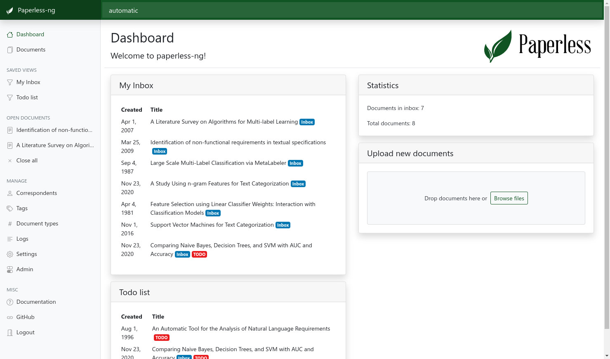

The document list provides three different styles to scroll through your documents:

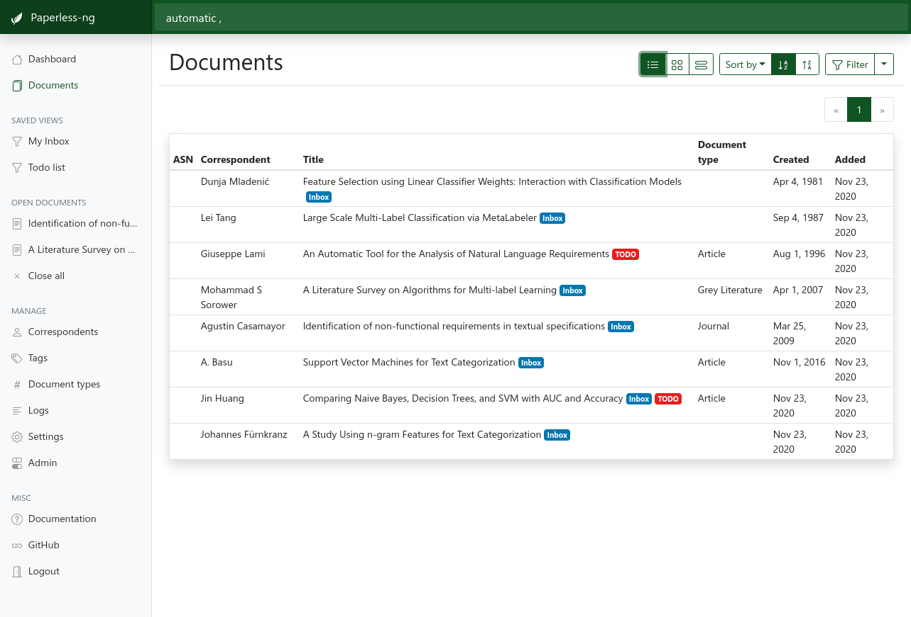
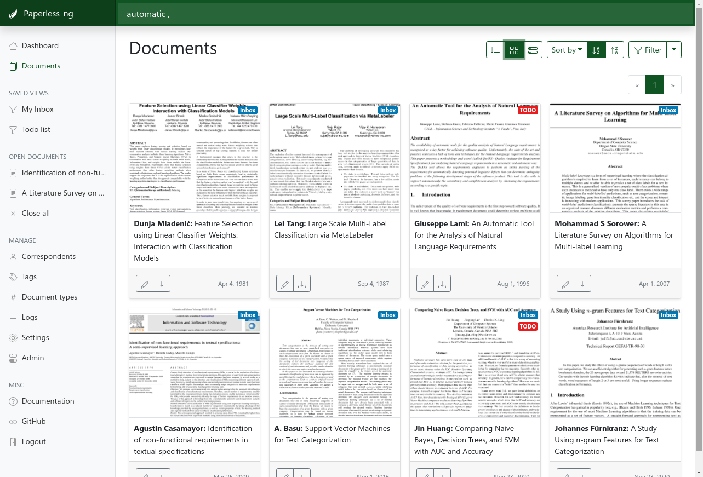
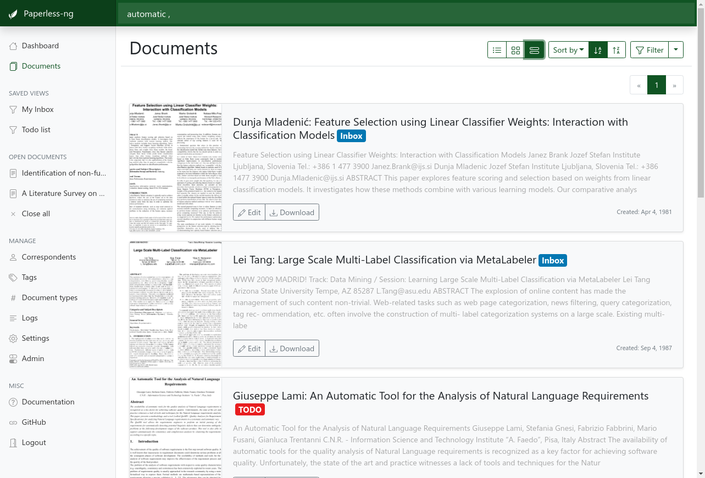

Extensive filtering mechanisms:

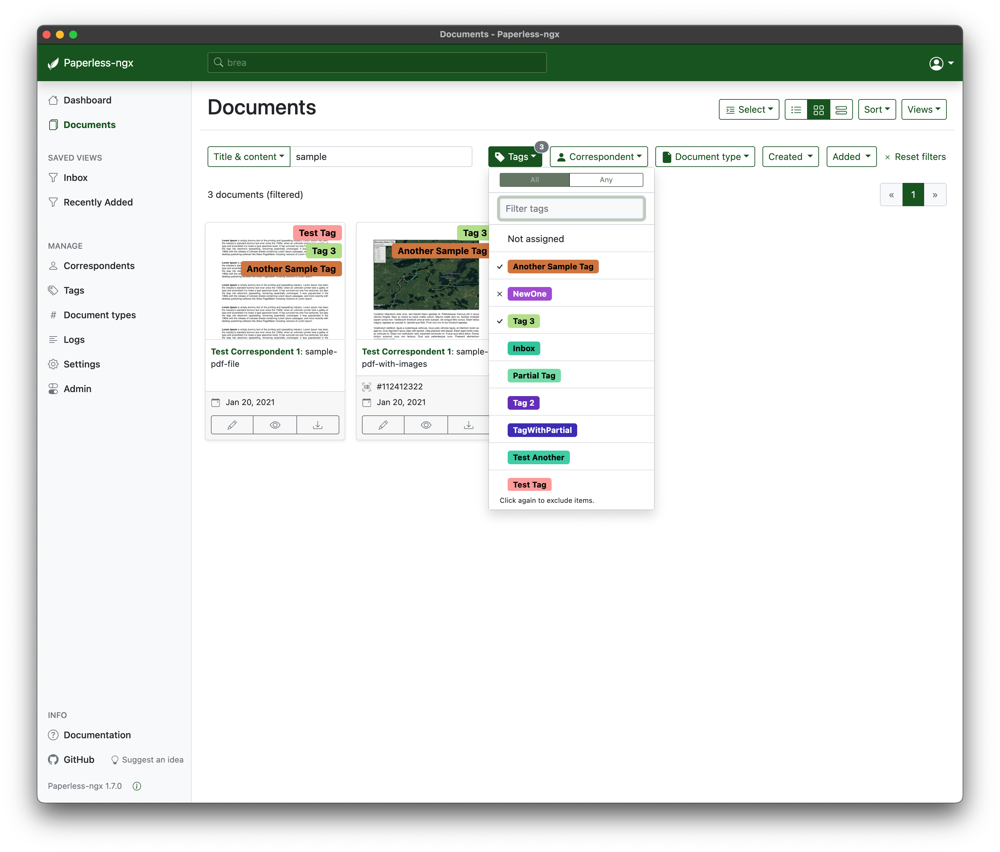

Side-by-side editing of documents. Optimized for 1080p.

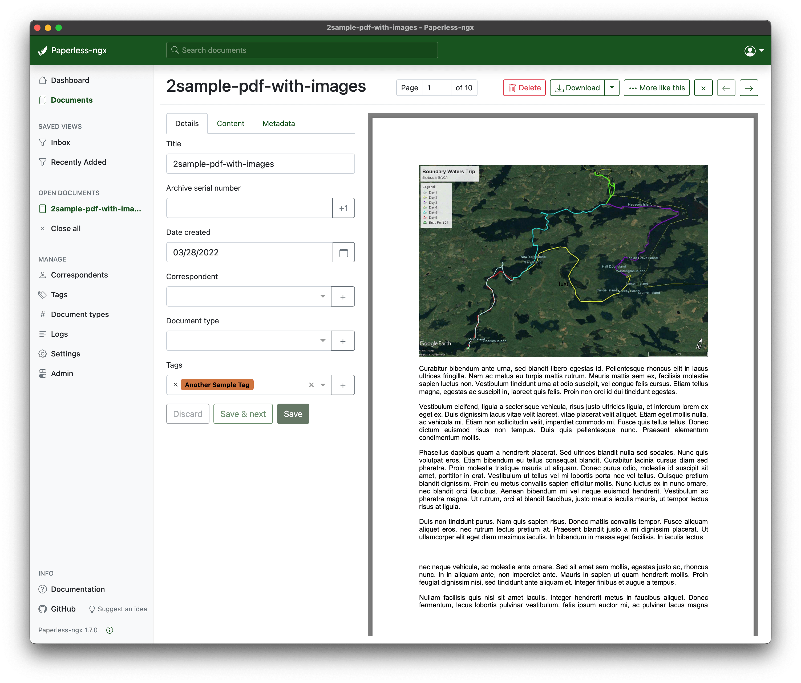

Tag editing. This looks about the same for correspondents and document types.

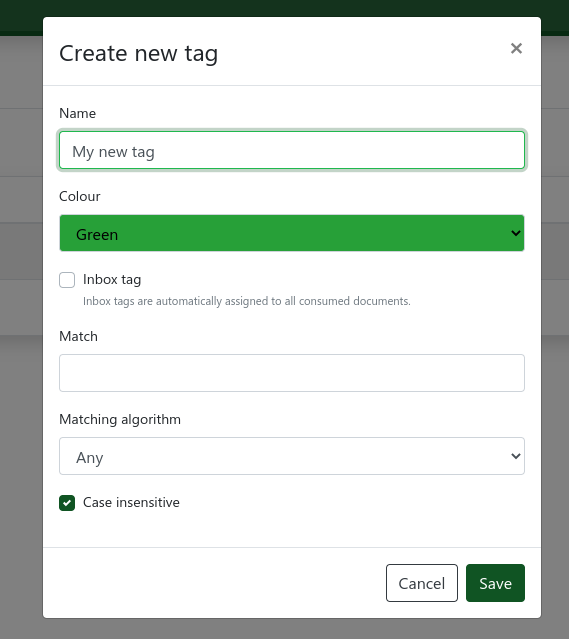

Searching provides auto complete and highlights the results.

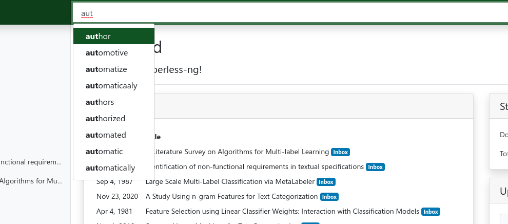
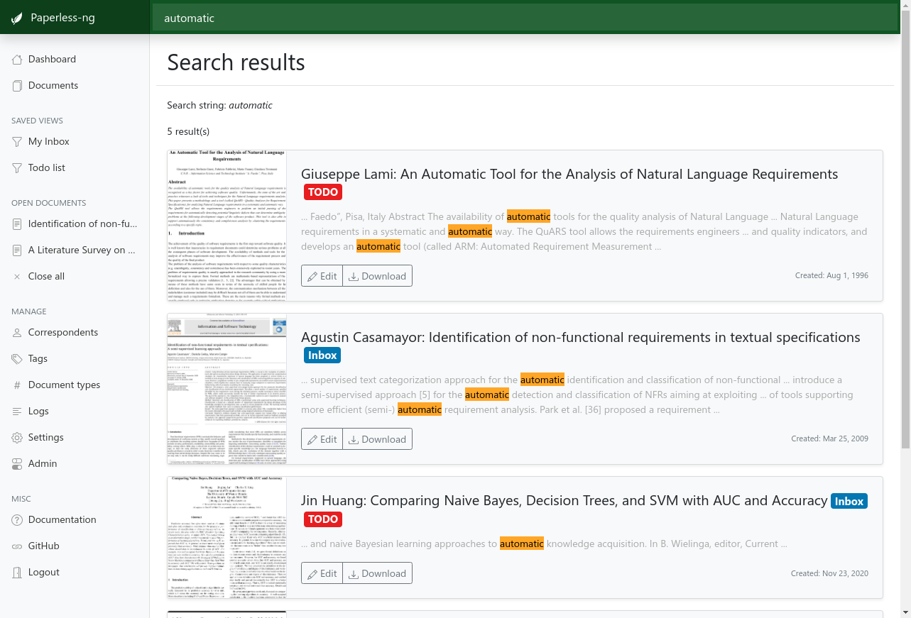

Fancy mail filters!

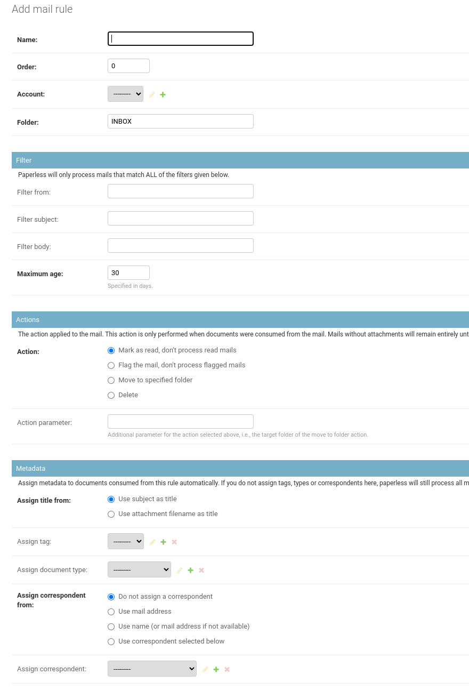

Mobile support in the future? This kinda works, however some layouts are still
too wide.

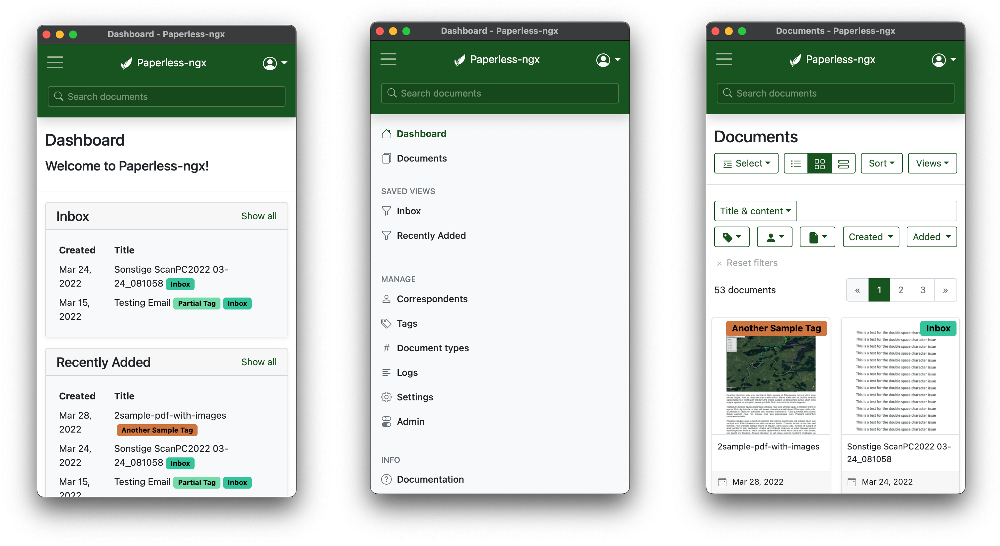

