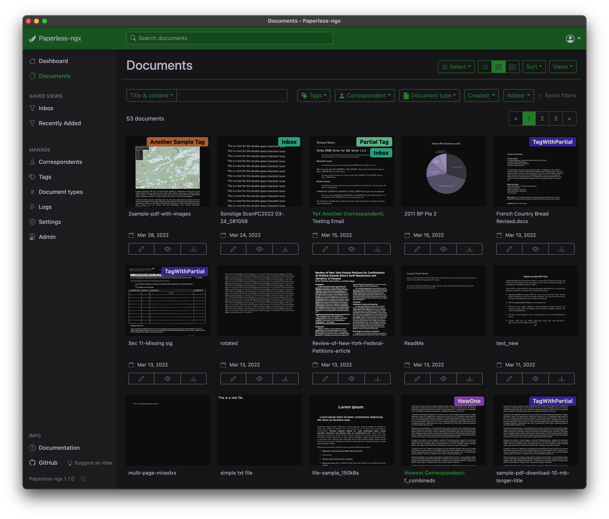

.. _screenshots:

***********
Screenshots
***********

This is what Paperless-ngx looks like.

The dashboard shows customizable views on your document and allows document uploads:

.. image:: _static/screenshots/dashboard.png
    :target: _static/screenshots/dashboard.png

The document list provides three different styles to scroll through your documents:

.. image:: _static/screenshots/documents-table.png
    :target: _static/screenshots/documents-table.png
.. image:: _static/screenshots/documents-smallcards.png
    :target: _static/screenshots/documents-smallcards.png
.. image:: _static/screenshots/documents-largecards.png
    :target: _static/screenshots/documents-largecards.png

Paperless-ngx also supports "dark mode":

Extensive filtering mechanisms:

.. image:: _static/screenshots/documents-filter.png
    :target: _static/screenshots/documents-filter.png

Bulk editing of document tags, correspondents, etc.:

.. image:: _static/screenshots/bulk-edit.png
    :target: _static/screenshots/bulk-edit.png

Side-by-side editing of documents:

.. image:: _static/screenshots/editing.png
    :target: _static/screenshots/editing.png

Tag editing. This looks about the same for correspondents and document types.

.. image:: _static/screenshots/new-tag.png
    :target: _static/screenshots/new-tag.png

Searching provides auto complete and highlights the results.

.. image:: _static/screenshots/search-preview.png
    :target: _static/screenshots/search-preview.png
.. image:: _static/screenshots/search-results.png
    :target: _static/screenshots/search-results.png

Fancy mail filters!

.. image:: _static/screenshots/mail-rules-edited.png
    :target: _static/screenshots/mail-rules-edited.png

Mobile devices are supported.

.. image:: _static/screenshots/mobile.png
    :target: _static/screenshots/mobile.png
