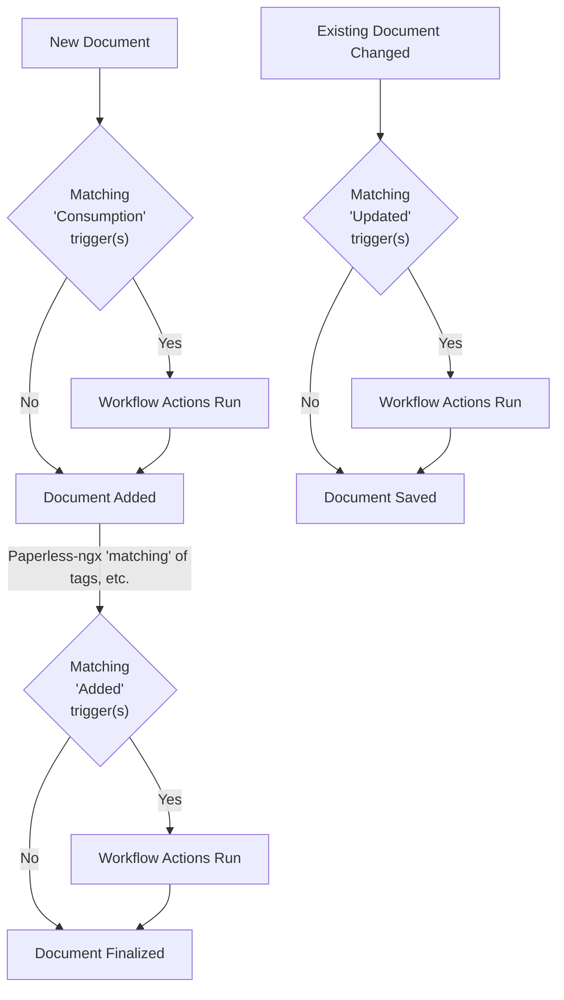

# Usage Overview

Paperless is an application that manages your personal documents. With
the help of a document scanner (see [the scanners wiki](https://github.com/paperless-ngx/paperless-ngx/wiki/Scanner-&-Software-Recommendations)),
paperless transforms your unwieldy physical document binders into a searchable archive
and provides many utilities for finding and managing your documents.

## Terms and definitions

Paperless essentially consists of two different parts for managing your
documents:

-   The _consumer_ watches a specified folder and adds all documents in
    that folder to paperless.
-   The _web server_ provides a UI that you use to manage and search for
    your scanned documents.

Each document has a couple of fields that you can assign to them:

-   A _Document_ is a piece of paper that sometimes contains valuable
    information.
-   The _correspondent_ of a document is the person, institution or
    company that a document either originates from, or is sent to.
-   A _tag_ is a label that you can assign to documents. Think of labels
    as more powerful folders: Multiple documents can be grouped together
    with a single tag, however, a single document can also have multiple
    tags. This is not possible with folders. The reason folders are not
    implemented in paperless is simply that tags are much more versatile
    than folders.
-   A _document type_ is used to demarcate the type of a document such
    as letter, bank statement, invoice, contract, etc. It is used to
    identify what a document is about.
-   The _date added_ of a document is the date the document was scanned
    into paperless. You cannot and should not change this date.
-   The _date created_ of a document is the date the document was
    initially issued. This can be the date you bought a product, the
    date you signed a contract, or the date a letter was sent to you.
-   The _archive serial number_ (short: ASN) of a document is the
    identifier of the document in your physical document binders. See
    [recommended workflow](#usage-recommended-workflow) below.
-   The _content_ of a document is the text that was OCR'ed from the
    document. This text is fed into the search engine and is used for
    matching tags, correspondents and document types.

## Adding documents to paperless

Once you've got Paperless setup, you need to start feeding documents
into it. When adding documents to paperless, it will perform the
following operations on your documents:

1.  OCR the document, if it has no text. Digital documents usually have
    text, and this step will be skipped for those documents.
2.  Paperless will create an archivable PDF/A document from your
    document. If this document is coming from your scanner, it will have
    embedded selectable text.
3.  Paperless performs automatic matching of tags, correspondents and
    types on the document before storing it in the database.

!!! tip

    This process can be configured to fit your needs. If you don't want
    paperless to create archived versions for digital documents, you can
    configure that by configuring
    `PAPERLESS_OCR_SKIP_ARCHIVE_FILE=with_text`. Please read the
    [relevant section in the documentation](configuration.md#ocr).

!!! note

    No matter which options you choose, Paperless will always store the
    original document that it found in the consumption directory or in the
    mail and will never overwrite that document. Archived versions are
    stored alongside the original versions. Any files found in the
    consumption directory will stored inside the Paperless-ngx file
    structure and will not be retained in the consumption directory.

### The consumption directory

The primary method of getting documents into your database is by putting
them in the consumption directory. The consumer waits patiently, looking
for new additions to this directory. When it finds them,
the consumer goes about the process of parsing them with the OCR,
indexing what it finds, and storing it in the media directory. You should
think of this folder as a temporary location, as files will be re-created
inside Paperless-ngx and removed from the consumption folder.

Getting stuff into this directory is up to you. If you're running
Paperless on your local computer, you might just want to drag and drop
files there, but if you're running this on a server and want your
scanner to automatically push files to this directory, you'll need to
setup some sort of service to accept the files from the scanner.
Typically, you're looking at an FTP server like
[Proftpd](http://www.proftpd.org/) or a Windows folder share with
[Samba](https://www.samba.org/).

!!! warning

    Files found in the consumption directory that are consumed will be
    removed from the consumption directory and stored inside the
    Paperless-ngx file structure using any settings / storage paths
    you have specified. This action is performed as safely as possible
    but this means it is expected that files in the consumption
    directory will no longer exist (there) after being consumed.

### Web UI Upload

The dashboard has a button to upload documents to paperless or you
can simply drag a file anywhere into the app to initiate the consumption
process.

### Mobile upload {#usage-mobile_upload}

Please see [the wiki](https://github.com/paperless-ngx/paperless-ngx/wiki/Related-Projects) for a user-maintained list of related projects and
software (e.g. for mobile devices) that is compatible with Paperless-ngx.

### Email {#usage-email}

You can tell paperless-ngx to consume documents from your email
accounts. This is a very flexible and powerful feature, if you regularly
received documents via mail that you need to archive. The mail consumer
can be configured via the frontend settings (/settings/mail) in the following
manner:

1.  Define e-mail accounts.
2.  Define mail rules for your account.

These rules perform the following:

1.  Connect to the mail server.
2.  Fetch all matching mails (as defined by folder, maximum age and the
    filters)
3.  Check if there are any consumable attachments.
4.  If so, instruct paperless to consume the attachments and optionally
    use the metadata provided in the rule for the new document.
5.  If documents were consumed from a mail, the rule action is performed
    on that mail.

Paperless will check all emails only once and completely ignore messages
that do not match your filters. It will also only perform the rule action
on e-mails that it has consumed documents from. The filename attachment
patterns can include wildcards and multiple patterns separated by a comma.

The actions all ensure that the same mail is not consumed twice by
different means. These are as follows:

-   **Delete:** Immediately deletes mail that paperless has consumed
    documents from. Use with caution.
-   **Mark as read:** Mark consumed mail as read. Paperless will not
    consume documents from already read mails. If you read a mail before
    paperless sees it, it will be ignored.
-   **Flag:** Sets the 'important' flag on mails with consumed
    documents. Paperless will not consume flagged mails.
-   **Move to folder:** Moves consumed mails out of the way so that
    paperless won't consume them again.
-   **Add custom Tag:** Adds a custom tag to mails with consumed
    documents (the IMAP standard calls these "keywords"). Paperless
    will not consume mails already tagged. Not all mail servers support
    this feature!

    -   **Apple Mail support:** Apple Mail clients allow differently colored tags. For this to work use `apple:<color>` (e.g. _apple:green_) as a custom tag. Available colors are _red_, _orange_, _yellow_, _blue_, _green_, _violet_ and _grey_.

!!! warning

    The mail consumer will perform these actions on all mails it has
    consumed documents from. Keep in mind that the actual consumption
    process may fail for some reason, leaving you with missing documents in
    paperless.

!!! note

    With the correct set of rules, you can completely automate your email
    documents. Create rules for every correspondent you receive digital
    documents from and paperless will read them automatically. The default
    action "mark as read" is pretty tame and will not cause any damage or
    data loss whatsoever.

    You can also setup a special folder in your mail account for paperless
    and use your favorite mail client to move to be consumed mails into that
    folder automatically or manually and tell paperless to move them to yet
    another folder after consumption. It's up to you.

!!! note

    When defining a mail rule with a folder, you may need to try different
    characters to define how the sub-folders are separated. Common values
    include ".", "/" or "\|", but this varies by the mail server.
    Check the documentation for your mail server. In the event of an error
    fetching mail from a certain folder, check the Paperless logs. When a
    folder is not located, Paperless will attempt to list all folders found
    in the account to the Paperless logs.

!!! note

    Paperless will process the rules in the order defined in the admin page.

    You can define catch-all rules and have them executed last to consume
    any documents not matched by previous rules. Such a rule may assign an
    "Unknown mail document" tag to consumed documents so you can inspect
    them further.

Paperless is set up to check your mails every 10 minutes. This can be
configured via [`PAPERLESS_EMAIL_TASK_CRON`](configuration.md#PAPERLESS_EMAIL_TASK_CRON)

#### OAuth Email Setup

Paperless-ngx supports OAuth2 authentication for Gmail and Outlook email accounts. To set up an email account with OAuth2, you will need to create a 'developer' app with the respective provider and obtain the client ID and client secret and set the appropriate [configuration variables](configuration.md#email_oauth). You will also need to set either [`PAPERLESS_OAUTH_CALLBACK_BASE_URL`](configuration.md#PAPERLESS_OAUTH_CALLBACK_BASE_URL) or [`PAPERLESS_URL`](configuration.md#PAPERLESS_URL) to the correct value for the OAuth2 flow to work correctly.

Specific instructions for setting up the required 'developer' app with Google or Microsoft are beyond the scope of this documentation, but you can find user-maintained instructions in [the wiki](https://github.com/paperless-ngx/paperless-ngx/wiki/Email-OAuth-App-Setup) or by searching the web.

Once setup, navigating to the email settings page in Paperless-ngx will allow you to add an email account for Gmail or Outlook using OAuth2. After authenticating, you will be presented with the newly-created account where you will need to enter and save your email address. After this, the account will work as any other email account in Paperless-ngx and refreshing tokens will be handled automatically.

### REST API

You can also submit a document using the REST API, see [POSTing documents](api.md#file-uploads)
for details.

## Permissions

Permissions in Paperless-ngx are based around ['global' permissions](#global-permissions) as well as
['object-level' permissions](#object-permissions). Global permissions determine which parts of the
application a user can access (e.g. Documents, Tags, Settings) and object-level determine which
objects are visible or editable. All objects have an 'owner' and 'view' and 'edit' permissions which
can be granted to other users or groups. The paperless-ngx permissions system uses the built-in user
model of the backend framework, Django.

!!! tip

    Object-level permissions only apply to the object itself. In other words, setting permissions
    for a Tag will _not_ affect the permissions of documents that have the Tag.

Permissions can be set using the new "Permissions" tab when editing documents, or bulk-applied
in the UI by selecting documents and choosing the "Permissions" button.

### Default permissions

[Workflows](#workflows) provide advanced ways to control permissions.

For objects created via the web UI (tags, doc types, etc.) the default is to set the current user
as owner and no extra permissions, but you can explicitly set these under Settings > Permissions.

Documents consumed via the consumption directory do not have an owner or additional permissions set by default, but again, can be controlled with [Workflows](#workflows).

### Users and Groups

Paperless-ngx supports editing users and groups via the 'frontend' UI, which can be found under
Settings > Users & Groups, assuming the user has access. If a user is designated
as a member of a group those permissions will be inherited and this is reflected in the UI. Explicit
permissions can be granted to limit access to certain parts of the UI (and corresponding API endpoints).

!!! tip

    By default, new users are not granted any permissions, except those inherited from any group(s) of which they are a member.

#### Superusers

Superusers can access all parts of the front and backend application as well as any and all objects.

#### Admin Status

Admin status (Django 'staff status') grants access to viewing the paperless logs and the system status dialog
as well as accessing the Django backend.

#### Detailed Explanation of Global Permissions {#global-permissions}

Global permissions define what areas of the app and API endpoints users can access. For example, they
determine if a user can create, edit, delete or view _any_ documents, but individual documents themselves
still have "object-level" permissions.

| Type          | Details                                                                                                                                                                  |
| ------------- | ------------------------------------------------------------------------------------------------------------------------------------------------------------------------ |
| AppConfig     | _Change_ or higher permissions grants access to the "Application Configuration" area.                                                                                    |
| Correspondent | Add, edit, delete or view Correspondents.                                                                                                                                |
| CustomField   | Add, edit, delete or view Custom Fields.                                                                                                                                 |
| Document      | Add, edit, delete or view Documents.                                                                                                                                     |
| DocumentType  | Add, edit, delete or view Document Types.                                                                                                                                |
| Group         | Add, edit, delete or view Groups.                                                                                                                                        |
| MailAccount   | Add, edit, delete or view Mail Accounts.                                                                                                                                 |
| MailRule      | Add, edit, delete or view Mail Rules.                                                                                                                                    |
| Note          | Add, edit, delete or view Notes.                                                                                                                                         |
| PaperlessTask | View or dismiss (_Change_) File Tasks.                                                                                                                                   |
| SavedView     | Add, edit, delete or view Saved Views.                                                                                                                                   |
| ShareLink     | Add, delete or view Share Links.                                                                                                                                         |
| StoragePath   | Add, edit, delete or view Storage Paths.                                                                                                                                 |
| Tag           | Add, edit, delete or view Tags.                                                                                                                                          |
| UISettings    | Add, edit, delete or view the UI settings that are used by the web app.<br/>:warning: **Users that will access the web UI must be granted at least _View_ permissions.** |
| User          | Add, edit, delete or view Users.                                                                                                                                         |
| Workflow      | Add, edit, delete or view Workflows.<br/>Note that Workflows are global, in other words all users who can access workflows have access to the same set of them.          |

#### Detailed Explanation of Object Permissions {#object-permissions}

| Type  | Details                                                                                                                                                                                                                                                                                                                                  |
| ----- | ---------------------------------------------------------------------------------------------------------------------------------------------------------------------------------------------------------------------------------------------------------------------------------------------------------------------------------------- |
| Owner | By default objects are only visible and editable by their owner.<br/>Only the object owner can grant permissions to other users or groups.<br/>Additionally, only document owners can create share links and add / remove custom fields.<br/>For backwards compatibility objects can have no owner which makes them visible to any user. |
| View  | Confers the ability to view (not edit) a document, tag, etc.<br/>Users without 'view' (or higher) permissions will be shown _'Private'_ in place of the object name for example when viewing a document with a tag for which the user doesn't have permissions.                                                                          |
| Edit  | Confers the ability to edit (and view) a document, tag, etc.                                                                                                                                                                                                                                                                             |

### Password reset

In order to enable the password reset feature you will need to setup an SMTP backend, see
[`PAPERLESS_EMAIL_HOST`](configuration.md#PAPERLESS_EMAIL_HOST). If your installation does not have
[`PAPERLESS_URL`](configuration.md#PAPERLESS_URL) set, the reset link included in emails will use the server host.

### Two-factor authentication

Users can enable two-factor authentication (2FA) for their accounts from the 'My Profile' dialog. Opening the dropdown reveals a QR code that can be scanned by a 2FA app (e.g. Google Authenticator) to generate a code. The code must then be entered in the dialog to enable 2FA. If the code is accepted and 2FA is enabled, the user will be shown a set of 10 recovery codes that can be used to login in the event that the 2FA device is lost or unavailable. These codes should be stored securely and cannot be retrieved again. Once enabled, users will be required to enter a code from their 2FA app when logging in.

Should a user lose access to their 2FA device and all recovery codes, a superuser can disable 2FA for the user from the 'Users & Groups' management screen.

## Workflows

!!! note

    v2.3 added "Workflows" and existing "Consumption Templates" were converted automatically to the new more powerful format.

Workflows allow hooking into the Paperless-ngx document pipeline, for example to alter what metadata (tags, doc types) and
permissions (owner, privileges) are assigned to documents. Workflows can have multiple 'triggers' and 'actions'. Triggers
are events (with optional filtering rules) that will cause the workflow to be run and actions are the set of sequential
actions to apply.

In general, workflows and any actions they contain are applied sequentially by sort order. For "assignment" actions, subsequent
workflow actions will override previous assignments, except for assignments that accept multiple items e.g. tags, custom
fields and permissions, which will be merged.

### Workflow Triggers

#### Types

Currently, there are three events that correspond to workflow trigger 'types':

1. **Consumption Started**: _before_ a document is consumed, so events can include filters by source (mail, consumption
   folder or API), file path, file name, mail rule
2. **Document Added**: _after_ a document is added. At this time, file path and source information is no longer available,
   but the document content has been extracted and metadata such as document type, tags, etc. have been set, so these can now
   be used for filtering.
3. **Document Updated**: when a document is updated. Similar to 'added' events, triggers can include filtering by content matching,
   tags, doc type, or correspondent.
4. **Scheduled**: a scheduled trigger that can be used to run workflows at a specific time. The date used can be either the document
   added, created, updated date or you can specify a (date) custom field. You can also specify a day offset from the date.

The following flow diagram illustrates the three document trigger types:



#### Filters {#workflow-trigger-filters}

Workflows allow you to filter by:

-   Source, e.g. documents uploaded via consume folder, API (& the web UI) and mail fetch
-   File name, including wildcards e.g. \*.pdf will apply to all pdfs
-   File path, including wildcards. Note that enabling `PAPERLESS_CONSUMER_RECURSIVE` would allow, for
    example, automatically assigning documents to different owners based on the upload directory.
-   Mail rule. Choosing this option will force 'mail fetch' to be the workflow source.
-   Content matching (`Added` and `Updated` triggers only). Filter document content using the matching settings.
-   Tags (`Added` and `Updated` triggers only). Filter for documents with any of the specified tags
-   Document type (`Added` and `Updated` triggers only). Filter documents with this doc type
-   Correspondent (`Added` and `Updated` triggers only). Filter documents with this correspondent

### Workflow Actions

#### Types

The following workflow action types are available:

##### Assignment

"Assignment" actions can assign:

-   Title, see [workflow placeholders](usage.md#workflow-placeholders) below
-   Tags, correspondent, document type and storage path
-   Document owner
-   View and / or edit permissions to users or groups
-   Custom fields. Note that no value for the field will be set

##### Removal

"Removal" actions can remove either all of or specific sets of the following:

-   Tags, correspondents, document types or storage paths
-   Document owner
-   View and / or edit permissions
-   Custom fields

##### Email

"Email" actions can send documents via email. This action requires a mail server to be [configured](configuration.md#email-sending). You can specify:

-   The recipient email address(es) separated by commas
-   The subject and body of the email, which can include placeholders, see [placeholders](usage.md#workflow-placeholders) below
-   Whether to include the document as an attachment

##### Webhook

"Webhook" actions send a POST request to a specified URL. You can specify:

-   The URL to send the request to
-   The request body as text or as key-value pairs, which can include placeholders, see [placeholders](usage.md#workflow-placeholders) below.
-   The request headers as key-value pairs

#### Workflow placeholders

Some workflow text can include placeholders but the available options differ depending on the type of
workflow trigger. This is because at the time of consumption (when the text is to be set), no automatic tags etc. have been
applied. You can use the following placeholders with any trigger type:

-   `{correspondent}`: assigned correspondent name
-   `{document_type}`: assigned document type name
-   `{owner_username}`: assigned owner username
-   `{added}`: added datetime
-   `{added_year}`: added year
-   `{added_year_short}`: added year
-   `{added_month}`: added month
-   `{added_month_name}`: added month name
-   `{added_month_name_short}`: added month short name
-   `{added_day}`: added day
-   `{added_time}`: added time in HH:MM format
-   `{original_filename}`: original file name without extension
-   `{filename}`: current file name without extension

The following placeholders are only available for "added" or "updated" triggers

-   `{created}`: created datetime
-   `{created_year}`: created year
-   `{created_year_short}`: created year
-   `{created_month}`: created month
-   `{created_month_name}`: created month name
-   `{created_month_name_short}`: created month short name
-   `{created_day}`: created day
-   `{created_time}`: created time in HH:MM format
-   `{doc_url}`: URL to the document in the web UI. Requires the `PAPERLESS_URL` setting to be set.

### Workflow permissions

All users who have application permissions for editing workflows can see the same set
of workflows. In other words, workflows themselves intentionally do not have an owner or permissions.

Given their potentially far-reaching capabilities, you may want to restrict access to workflows.

Upon migration, existing installs will grant access to workflows to users who can add
documents (and superusers who can always access all parts of the app).

## Custom Fields {#custom-fields}

Paperless-ngx supports the use of custom fields for documents as of v2.0, allowing a user
to optionally attach data to documents which does not fit in the existing set of fields
Paperless-ngx provides.

1. First, create a custom field (under "Manage"), with a given name and data type. This could be something like "Invoice Number" or "Date Paid", with a data type of "Number", "Date", "String", etc.
2. Once created, a field can be used with documents and data stored. To do so, use the "Custom Fields" menu on the document detail page, choose your existing field from the dropdown. Once the field is visible in the form you can enter the appropriate data which will be validated according to the custom field "data type".
3. Fields can be removed by hovering over the field name revealing a "Remove" button.

!!! important

    Added / removed fields, as well as any data, is not saved to the document until you
    actually hit the "Save" button, similar to other changes on the document details page.

!!! note

    Once the data type for a field is set, it cannot be changed.

Multiple fields may be attached to a document but the same field name cannot be assigned multiple times to the a single document.

The following custom field types are supported:

-   `Text`: any text
-   `Boolean`: true / false (check / unchecked) field
-   `Date`: date
-   `URL`: a valid url
-   `Integer`: integer number e.g. 12
-   `Number`: float number e.g. 12.3456
-   `Monetary`: [ISO 4217 currency code](https://en.wikipedia.org/wiki/ISO_4217#List_of_ISO_4217_currency_codes) and a number with exactly two decimals, e.g. USD12.30
-   `Document Link`: reference(s) to other document(s) displayed as links, automatically creates a symmetrical link in reverse
-   `Select`: a pre-defined list of strings from which the user can choose

## Share Links

Paperless-ngx added the ability to create shareable links to files in version 2.0. You can find the button for this on the document detail screen.

-   Share links do not require a user to login and thus link directly to a file.
-   Links are unique and are of the form `{paperless-url}/share/{randomly-generated-slug}`.
-   Links can optionally have an expiration time set.
-   After a link expires or is deleted users will be redirected to the regular paperless-ngx login.

!!! tip

    If your paperless-ngx instance is behind a reverse-proxy you may want to create an exception to bypass any authentication layers that are part of your setup in order to make links truly publicly-accessible. Of course, do so with caution.

## PDF Actions

Paperless-ngx supports four basic editing operations for PDFs (these operations currently cannot be performed on non-PDF files):

-   Merging documents: available when selecting multiple documents for 'bulk editing'.
-   Rotating documents: available when selecting multiple documents for 'bulk editing' and from an individual document's details page.
-   Splitting documents: available from an individual document's details page.
-   Deleting pages: available from an individual document's details page.

!!! important

    Note that rotation and deleting pages alter the Paperless-ngx _original_ file, which would, for example, invalidate a digital signature.

## Document History

As of version 2.7, Paperless-ngx automatically records all changes to a document and records this in an audit log. The feature requires [`PAPERLESS_AUDIT_LOG_ENABLED`](configuration.md#PAPERLESS_AUDIT_LOG_ENABLED) be enabled, which it is by default as of version 2.7.
Changes to documents are visible under the "History" tab. Note that certain changes such as those made by workflows, record the 'actor'
as "System".

## Document Trash

When you first delete a document it is moved to the 'trash' until either it is explicitly deleted or it is automatically removed after a set amount of time has passed.
You can set how long documents remain in the trash before being automatically deleted with [`PAPERLESS_EMPTY_TRASH_DELAY`](configuration.md#PAPERLESS_EMPTY_TRASH_DELAY), which defaults
to 30 days. Until the file is actually deleted (e.g. the trash is emptied), all files and database content remains intact and can be restored at any point up until that time.

Additionally you may configure a directory where deleted files are moved to when they the trash is emptied with [`PAPERLESS_EMPTY_TRASH_DIR`](configuration.md#PAPERLESS_EMPTY_TRASH_DIR).
Note that the empty trash directory only stores the original file, the archive file and all database information is permanently removed once a document is fully deleted.

## Best practices {#basic-searching}

Paperless offers a couple tools that help you organize your document
collection. However, it is up to you to use them in a way that helps you
organize documents and find specific documents when you need them. This
section offers a couple ideas for managing your collection.

Document types allow you to classify documents according to what they
are. You can define types such as "Receipt", "Invoice", or
"Contract". If you used to collect all your receipts in a single
binder, you can recreate that system in paperless by defining a document
type, assigning documents to that type and then filtering by that type
to only see all receipts.

Not all documents need document types. Sometimes its hard to determine
what the type of a document is or it is hard to justify creating a
document type that you only need once or twice. This is okay. As long as
the types you define help you organize your collection in the way you
want, paperless is doing its job.

Tags can be used in many different ways. Think of tags are more
versatile folders or binders. If you have a binder for documents related
to university / your car or health care, you can create these binders in
paperless by creating tags and assigning them to relevant documents.
Just as with documents, you can filter the document list by tags and
only see documents of a certain topic.

With physical documents, you'll often need to decide which folder the
document belongs to. The advantage of tags over folders and binders is
that a single document can have multiple tags. A physical document
cannot magically appear in two different folders, but with tags, this is
entirely possible.

!!! tip

    This can be used in many different ways. One example: Imagine you're
    working on a particular task, such as signing up for university. Usually
    you'll need to collect a bunch of different documents that are already
    sorted into various folders. With the tag system of paperless, you can
    create a new group of documents that are relevant to this task without
    destroying the already existing organization. When you're done with the
    task, you could delete the tag again, which would be equal to sorting
    documents back into the folder they belong into. Or keep the tag, up to
    you.

All of the logic above applies to correspondents as well. Attach them to
documents if you feel that they help you organize your collection.

When you've started organizing your documents, create a couple saved
views for document collections you regularly access. This is equal to
having labeled physical binders on your desk, except that these saved
views are dynamic and simply update themselves as you add documents to
the system.

Here are a couple examples of tags and types that you could use in your
collection.

-   An `inbox` tag for newly added documents that you haven't manually
    edited yet.
-   A tag `car` for everything car related (repairs, registration,
    insurance, etc)
-   A tag `todo` for documents that you still need to do something with,
    such as reply, or perform some task online.
-   A tag `bank account x` for all bank statement related to that
    account.
-   A tag `mail` for anything that you added to paperless via its mail
    processing capabilities.
-   A tag `missing_metadata` when you still need to add some metadata to
    a document, but can't or don't want to do this right now.

## Searching {#basic-usage_searching}

### Global search

The top search bar in the web UI performs a "global" search of the various
objects Paperless-ngx uses, including documents, tags, workflows, etc. Only
objects for which the user has appropriate permissions are returned. For
documents, if there are < 3 results, "advanced" search results (which use
the document index) will also be included. This can be disabled under settings.

### Document searches

Paperless offers an extensive searching mechanism that is designed to
allow you to quickly find a document you're looking for (for example,
that thing that just broke and you bought a couple months ago, that
contract you signed 8 years ago).

When you search paperless for a document, it tries to match this query
against your documents. Paperless will look for matching documents by
inspecting their content, title, correspondent, type and tags. Paperless
returns a scored list of results, so that documents matching your query
better will appear further up in the search results.

By default, paperless returns only documents which contain all words
typed in the search bar. However, paperless also offers advanced search
syntax if you want to drill down the results further.

Matching documents with logical expressions:

```
shopname AND (product1 OR product2)
```

Matching specific tags, correspondents or types:

```
type:invoice tag:unpaid
correspondent:university certificate
```

Matching dates:

```
created:[2005 to 2009]
added:yesterday
modified:today
```

Matching inexact words:

```
produ*name
```

!!! note

    Inexact terms are hard for search indexes. These queries might take a
    while to execute. That's why paperless offers auto complete and query
    correction.

All of these constructs can be combined as you see fit. If you want to
learn more about the query language used by paperless, paperless uses
Whoosh's default query language. Head over to [Whoosh query
language](https://whoosh.readthedocs.io/en/latest/querylang.html). For
details on what date parsing utilities are available, see [Date
parsing](https://whoosh.readthedocs.io/en/latest/dates.html#parsing-date-queries).

## Keyboard shortcuts / hotkeys

A list of available hotkeys can be shown on any page using <kbd>Shift</kbd> +
<kbd>?</kbd>. The help dialog shows only the keys that are currently available
based on which area of Paperless-ngx you are using.

## The recommended workflow {#usage-recommended-workflow}

Once you have familiarized yourself with paperless and are ready to use
it for all your documents, the recommended workflow for managing your
documents is as follows. This workflow also takes into account that some
documents have to be kept in physical form, but still ensures that you
get all the advantages for these documents as well.

The following diagram shows how easy it is to manage your documents.

{width=400}

### Preparations in paperless

-   Create an inbox tag that gets assigned to all new documents.
-   Create a TODO tag.

### Processing of the physical documents

Keep a physical inbox. Whenever you receive a document that you need to
archive, put it into your inbox. Regularly, do the following for all
documents in your inbox:

1.  For each document, decide if you need to keep the document in
    physical form. This applies to certain important documents, such as
    contracts and certificates.
2.  If you need to keep the document, write a running number on the
    document before scanning, starting at one and counting upwards. This
    is the archive serial number, or ASN in short.
3.  Scan the document.
4.  If the document has an ASN assigned, store it in a _single_ binder,
    sorted by ASN. Don't order this binder in any other way.
5.  If the document has no ASN, throw it away. Yay!

!!! tip

    Instead of writing a number on the document by hand, you may also prepare
    a spool of labels with barcodes with an ascending serial number, that are
    formatted like `ASN00001`.
    This also enables Paperless to automatically parse and process the ASN
    (if enabled in the config), so that you don't need to manually assign it.

Over time, you will notice that your physical binder will fill up. If it
is full, label the binder with the range of ASNs in this binder (i.e.,
"Documents 1 to 343"), store the binder in your cellar or elsewhere,
and start a new binder.

The idea behind this process is that you will never have to use the
physical binders to find a document. If you need a specific physical
document, you may find this document by:

1.  Searching in paperless for the document.
2.  Identify the ASN of the document, since it appears on the scan.
3.  Grab the relevant document binder and get the document. This is easy
    since they are sorted by ASN.

### Processing of documents in paperless

Once you have scanned in a document, proceed in paperless as follows.

1.  If the document has an ASN, assign the ASN to the document.
2.  Assign a correspondent to the document (i.e., your employer, bank,
    etc) This isn't strictly necessary but helps in finding a document
    when you need it.
3.  Assign a document type (i.e., invoice, bank statement, etc) to the
    document This isn't strictly necessary but helps in finding a
    document when you need it.
4.  Assign a proper title to the document (the name of an item you
    bought, the subject of the letter, etc)
5.  Check that the date of the document is correct. Paperless tries to
    read the date from the content of the document, but this fails
    sometimes if the OCR is bad or multiple dates appear on the
    document.
6.  Remove inbox tags from the documents.

!!! tip

    You can setup manual matching rules for your correspondents and tags and
    paperless will assign them automatically. After consuming a couple
    documents, you can even ask paperless to *learn* when to assign tags and
    correspondents by itself. For details on this feature, see
    [advanced matching](advanced_usage.md#matching).

### Task management

Some documents require attention and require you to act on the document.
You may take two different approaches to handle these documents based on
how regularly you intend to scan documents and use paperless.

-   If you scan and process your documents in paperless regularly,
    assign a TODO tag to all scanned documents that you need to process.
    Create a saved view on the dashboard that shows all documents with
    this tag.
-   If you do not scan documents regularly and use paperless solely for
    archiving, create a physical todo box next to your physical inbox
    and put documents you need to process in the TODO box. When you
    performed the task associated with the document, move it to the
    inbox.

## Architecture

Paperless-ngx consists of the following components:

-   **The webserver:** This serves the administration pages, the API,
    and the new frontend. This is the main tool you'll be using to interact
    with paperless. You may start the webserver directly with

    ```shell-session
    $ cd /path/to/paperless/src/
    $ gunicorn -c ../gunicorn.conf.py paperless.wsgi
    ```

    or by any other means such as Apache `mod_wsgi`.

-   **The consumer:** This is what watches your consumption folder for
    documents. However, the consumer itself does not really consume your
    documents. Now it notifies a task processor that a new file is ready
    for consumption. I suppose it should be named differently. This was
    also used to check your emails, but that's now done elsewhere as
    well.

    Start the consumer with the management command `document_consumer`:

    ```shell-session
    $ cd /path/to/paperless/src/
    $ python3 manage.py document_consumer
    ```

-   **The task processor:** Paperless relies on [Celery - Distributed
    Task Queue](https://docs.celeryq.dev/en/stable/index.html) for doing
    most of the heavy lifting. This is a task queue that accepts tasks
    from multiple sources and processes these in parallel. It also comes
    with a scheduler that executes certain commands periodically.

    This task processor is responsible for:

    -   Consuming documents. When the consumer finds new documents, it
        notifies the task processor to start a consumption task.
    -   The task processor also performs the consumption of any
        documents you upload through the web interface.
    -   Consuming emails. It periodically checks your configured
        accounts for new emails and notifies the task processor to
        consume the attachment of an email.
    -   Maintaining the search index and the automatic matching
        algorithm. These are things that paperless needs to do from time
        to time in order to operate properly.

    This allows paperless to process multiple documents from your
    consumption folder in parallel! On a modern multi core system, this
    makes the consumption process with full OCR blazingly fast.

    The task processor comes with a built-in admin interface that you
    can use to check whenever any of the tasks fail and inspect the
    errors (i.e., wrong email credentials, errors during consuming a
    specific file, etc).

-   A [redis](https://redis.io/) message broker: This is a really
    lightweight service that is responsible for getting the tasks from
    the webserver and the consumer to the task scheduler. These run in a
    different process (maybe even on different machines!), and
    therefore, this is necessary.

-   Optional: A database server. Paperless supports PostgreSQL, MariaDB
    and SQLite for storing its data.
